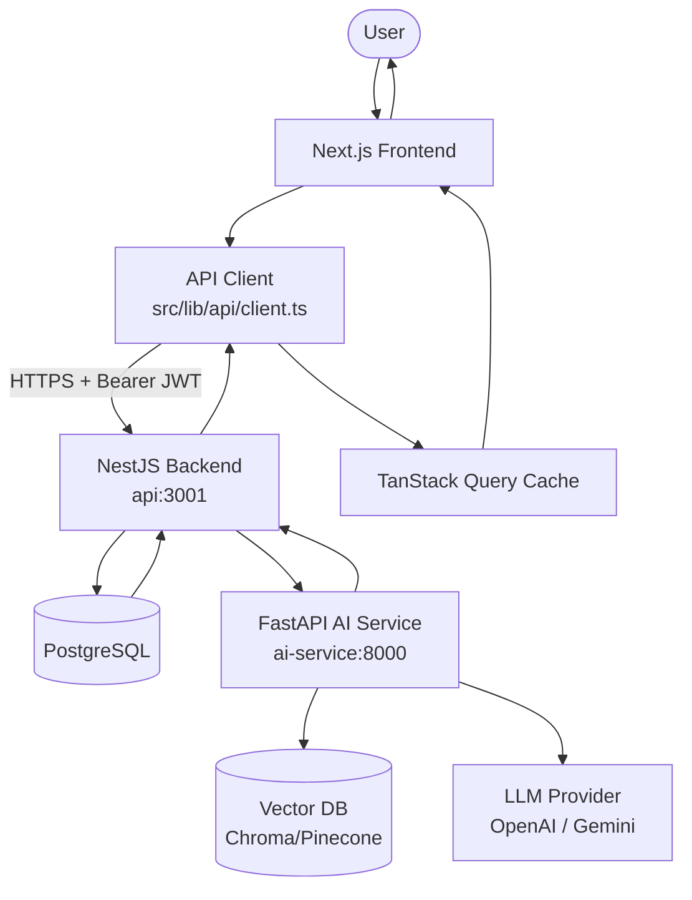
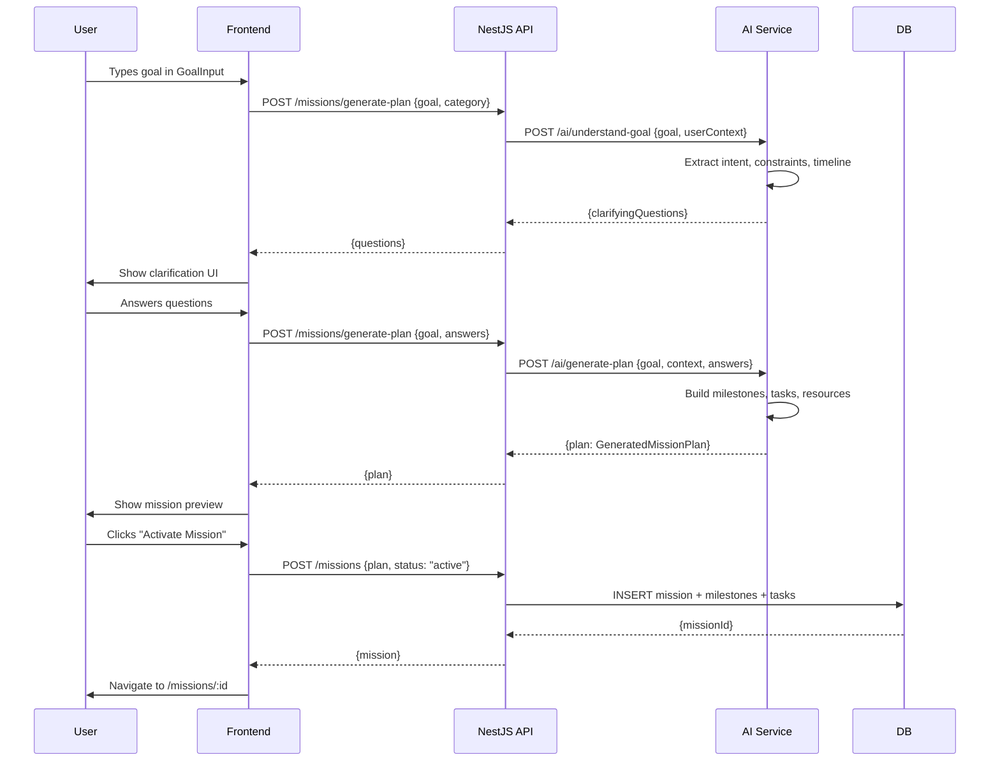
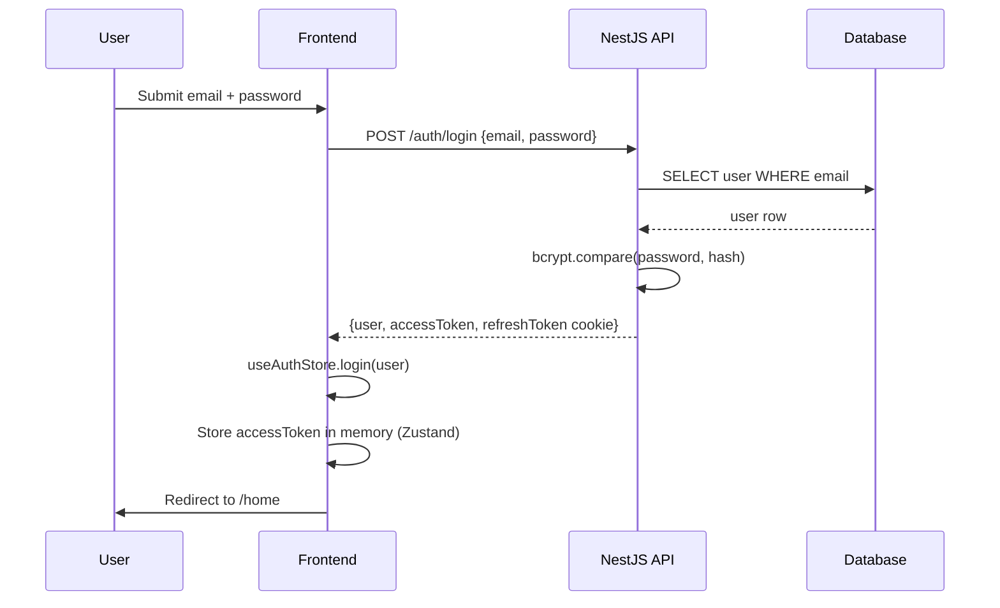
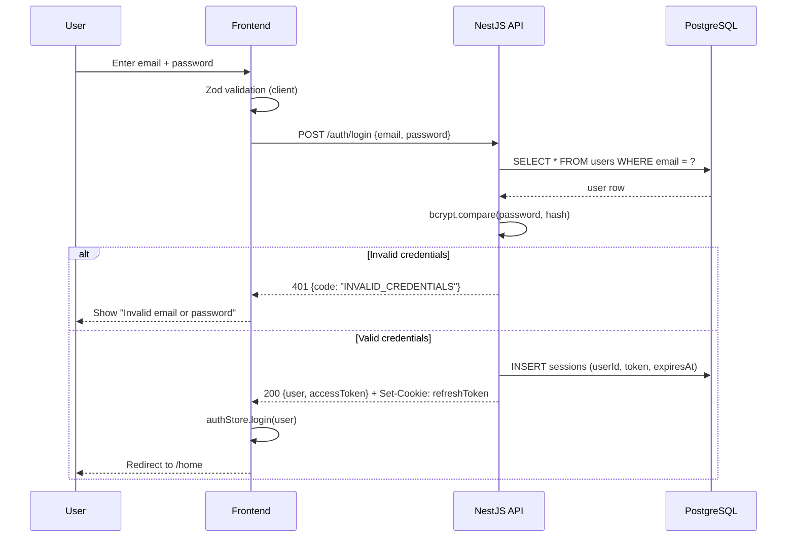
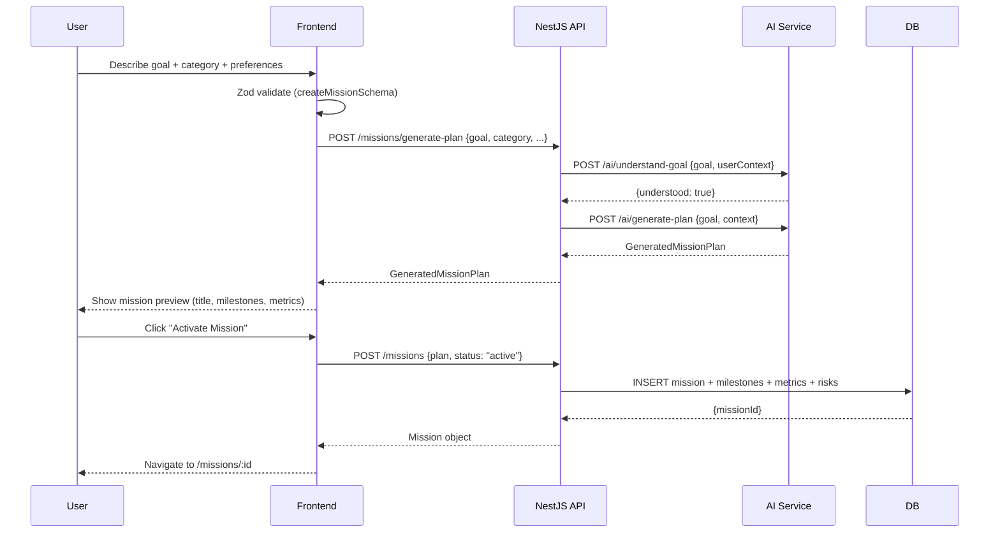
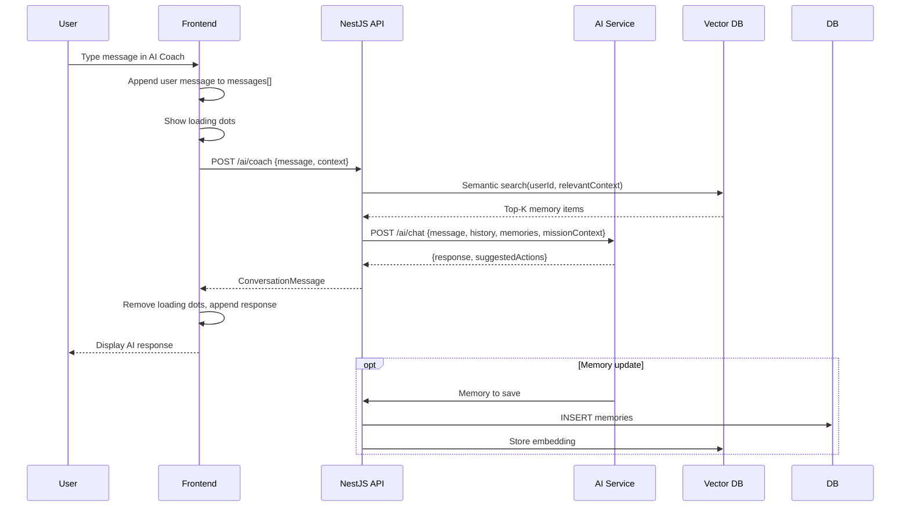
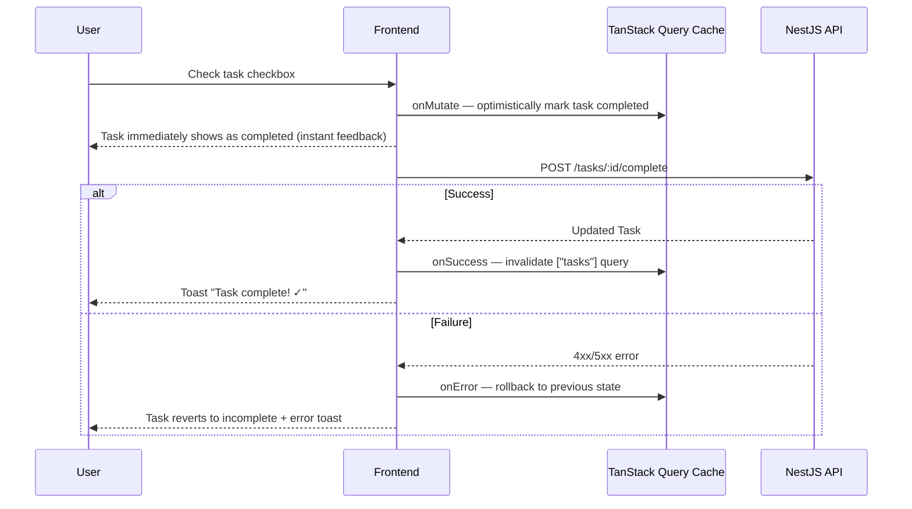
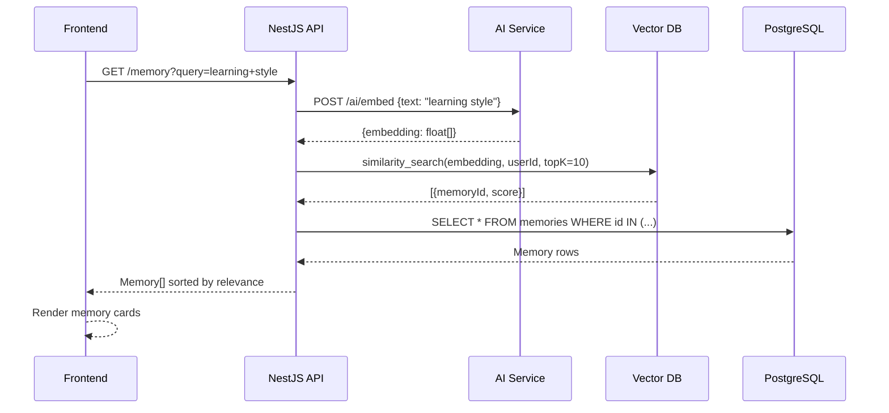
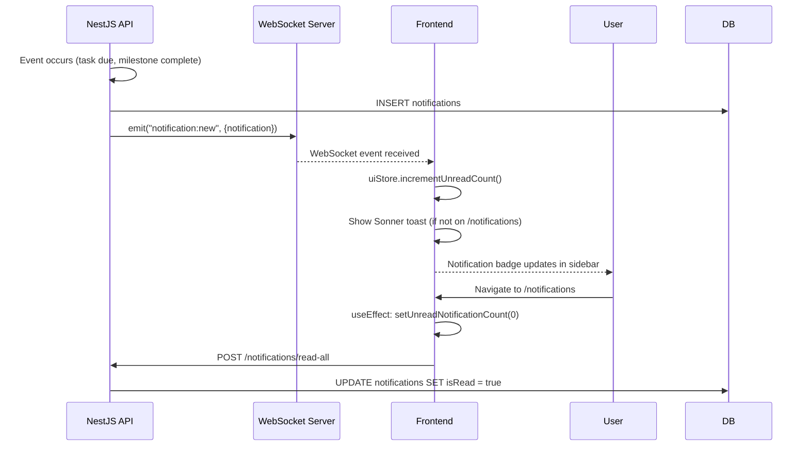

# LifeKit Frontend — Complete Technical Reference

> **Version:** 0.1.0 · **Framework:** Next.js 16 (App Router) · **Language:** TypeScript 5 (strict)
> **Status:** Active Development · **Platform:** Web, Mobile (PWA-ready)

---

## Table of Contents

1. [Project Overview](#1-project-overview)
2. [Tech Stack](#2-tech-stack)
3. [Project Architecture](#3-project-architecture)
4. [Folder Structure](#4-folder-structure)
5. [Application Flow](#5-application-flow)
6. [UI Architecture](#6-ui-architecture)
7. [Colour Palette](#7-colour-palette)
8. [Typography](#8-typography)
9. [Spacing System](#9-spacing-system)
10. [Theme System](#10-theme-system)
11. [API Integration](#11-api-integration)
12. [Backend Integration](#12-backend-integration)
13. [AI Service Integration](#13-ai-service-integration)
14. [Database Relationship](#14-database-relationship)
15. [Complete Endpoint Reference](#15-complete-endpoint-reference)
16. [Environment Variables](#16-environment-variables)
17. [Authentication Flow](#17-authentication-flow)
18. [State Management](#18-state-management)
19. [Error Handling](#19-error-handling)
20. [Performance Optimisation](#20-performance-optimisation)
21. [Security](#21-security)
22. [Build Instructions](#22-build-instructions)
23. [Deployment](#23-deployment)
24. [Common Issues](#24-common-issues)
25. [Development Guidelines](#25-development-guidelines)
26. [Feature Addition Guide](#26-feature-addition-guide)
27. [AI-Service Collaboration Guide](#27-ai-service-collaboration-guide)
28. [Backend Collaboration Guide](#28-backend-collaboration-guide)
29. [Database Collaboration Guide](#29-database-collaboration-guide)
30. [Sequence Diagrams](#30-sequence-diagrams)
31. [Glossary](#31-glossary)
32. [Quick Reference](#32-quick-reference)

---

## 1. Project Overview

### Purpose

LifeKit is an **AI Execution Marketplace for Human Goals**. The frontend is the primary user-facing product — it converts a user's stated goal into a structured **Life Mission**, generates an AI-powered roadmap, connects the user to marketplace resources, and tracks execution to completion.

This is **not** a chatbot application. It is a goal management and execution platform that uses AI as infrastructure.

### High-Level Architecture

```
┌─────────────────────────────────────────────────────────┐
│                    BROWSER / MOBILE                      │
│                                                         │
│  Next.js 16 App Router  ·  React 19  ·  Tailwind v4    │
│                                                         │
│  ┌──────────┐  ┌──────────┐  ┌──────────────────────┐  │
│  │  Zustand │  │ TanStack │  │   React Hook Form    │  │
│  │  Stores  │  │  Query   │  │   + Zod Schemas      │  │
│  └──────────┘  └──────────┘  └──────────────────────┘  │
│         ↕              ↕                                │
│  ┌─────────────────────────────────────────────────┐   │
│  │         API Client (src/lib/api/client.ts)      │   │
│  └────────────────────┬────────────────────────────┘   │
└───────────────────────┼─────────────────────────────────┘
                        │ HTTPS + Bearer JWT
          ┌─────────────┴──────────────┐
          │         NestJS API         │   apps/api
          │    (localhost:3001)         │
          └──────┬──────────┬──────────┘
                 │          │
      ┌──────────┘          └──────────────┐
      │  PostgreSQL                         │  FastAPI AI
      │  (Missions, Tasks,                  │  (apps/ai-service)
      │   Users, Memory)                    │  (localhost:8000)
      └─────────────────────────────────────┘
```

### Main Responsibilities

- Collect user goals and convert them to structured missions via AI
- Render roadmaps, milestones, and task lists
- Provide a real-time AI Coach and five Specialist AI Agents
- Surface a curated Marketplace with search, filter, and checkout
- Display proactively matched Opportunities (jobs, scholarships, grants)
- Persist and display Life Memory (user context across sessions)
- Track and visualise progress with analytics charts
- Support full subscription lifecycle (Free → Plus → Pro → Enterprise)
- Admin interface for platform operations

### Supported Platforms

| Platform | Support |
|---|---|
| Desktop (Chrome, Firefox, Safari, Edge) | ✅ Full |
| Tablet (iPad, Android tablet) | ✅ Responsive |
| Mobile (iOS Safari, Android Chrome) | ✅ Bottom nav + safe area |
| PWA (installable) | 🔜 Planned |

### Development Status

| Area | Status |
|---|---|
| Design system + all UI components | ✅ Complete |
| All 50 routes | ✅ Complete |
| Mock data (no backend required) | ✅ Complete |
| Real API integration | 🔜 Replace mock in `src/lib/api/` |
| Real authentication | 🔜 Replace mock in `stores/auth-store.ts` |
| WebSocket real-time | 🔜 Client ready, server needed |
| Payments (Razorpay/Stripe) | 🔜 UI wired, gateway pending |

---

## 2. Tech Stack

| Technology | Version | Purpose |
|---|---|---|
| **Next.js** | 16.2.12 | Framework — App Router, SSR, SSG, API Routes |
| **React** | 19.2.4 | UI library |
| **TypeScript** | 5.x (strict) | Language — all files typed, no `any` |
| **Tailwind CSS** | 4.x | Utility-first styling with CSS variables |
| **Radix UI** | Various | Accessible headless primitives (Dialog, Select, Tabs…) |
| **class-variance-authority** | 0.7.1 | Typed component variant system |
| **Framer Motion** | 11.3.30 | Page transitions, panel animations |
| **Zustand** | 5.0.14 | Client-side global state (auth, UI, missions) |
| **TanStack Query** | 5.56.2 | Server state, caching, background refetch |
| **React Hook Form** | 7.53.0 | Form state management |
| **Zod** | 3.23.8 | Schema validation (forms + API responses) |
| **Recharts** | 2.12.7 | Analytics charts (line, bar, pie, donut) |
| **Lucide React** | 0.441.0 | Icon set |
| **Sonner** | 1.5.0 | Toast notifications |
| **cmdk** | 1.0.0 | Command palette (Ctrl+K) |
| **date-fns** | 3.6.0 | Date formatting and arithmetic |
| **next-themes** | 0.3.0 | Light/dark/system theme switching |
| **tailwind-merge** | 3.6.0 | Smart Tailwind class merging |

### Architecture Decisions

| Decision | Rationale |
|---|---|
| App Router (not Pages) | Server Components by default, better streaming, layouts |
| Zustand over Redux | Minimal boilerplate, TypeScript-first, no providers |
| TanStack Query for server state | Caching, deduplication, background sync, devtools |
| Zod validation everywhere | Single schema definition shared between form and API |
| CSS variables + Tailwind | Runtime theme switching without JS |
| Radix UI primitives | WCAG 2.1 AA accessibility built-in |

---

## 3. Project Architecture

The frontend follows a **feature-first, layer-separated** architecture.

```
src/
├── app/              → Route definitions (Next.js App Router)
├── components/       → Reusable UI components (no business logic)
├── features/         → Feature modules (future: co-located per-feature logic)
├── hooks/            → Shared React hooks
├── lib/              → Infrastructure: API client, validation, utils
├── stores/           → Zustand global state stores
├── types/            → TypeScript type definitions
├── constants/        → Static data: routes, categories, mock data
├── config/           → App-level configuration
└── styles/           → Global CSS (globals.css)
```

### Layer Responsibilities

| Layer | Folder | Responsibility | Can import from |
|---|---|---|---|
| **Route** | `app/` | Page components, layouts, loading/error files | components, stores, lib, constants |
| **Component** | `components/` | Pure UI — renders props, emits events | ui, lib/utils, types |
| **Store** | `stores/` | Client-side reactive state | types, constants |
| **API Client** | `lib/api/` | HTTP calls, mock implementations | types, lib/utils |
| **Validation** | `lib/validation/` | Zod schemas, inferred types | types |
| **Types** | `types/` | TypeScript interfaces | (none — no side effects) |
| **Constants** | `constants/` | Routes, categories, mock data | types |

> **Rule:** Business logic never lives in page components or UI components. It belongs in `lib/api/`, stores, or custom hooks.

---

## 4. Folder Structure

```
apps/web/
│
├── src/
│   │
│   ├── app/                          # Next.js App Router
│   │   ├── (auth)/                   # Auth route group — no sidebar
│   │   │   ├── layout.tsx            # Auth shell — redirects if logged in
│   │   │   └── auth/
│   │   │       ├── sign-in/page.tsx
│   │   │       ├── sign-up/page.tsx
│   │   │       ├── forgot-password/page.tsx
│   │   │       ├── reset-password/page.tsx
│   │   │       ├── verify-email/page.tsx
│   │   │       ├── two-factor/page.tsx
│   │   │       └── callback/page.tsx
│   │   │
│   │   ├── (dashboard)/              # App route group — with sidebar
│   │   │   ├── layout.tsx            # ApplicationShell + auth guard
│   │   │   ├── loading.tsx           # Page-level skeleton
│   │   │   ├── error.tsx             # Error boundary
│   │   │   ├── home/page.tsx         # Dashboard command centre
│   │   │   ├── missions/
│   │   │   │   ├── page.tsx          # Mission list
│   │   │   │   ├── new/page.tsx      # Mission creation wizard
│   │   │   │   └── [id]/page.tsx     # Mission detail workspace
│   │   │   ├── tasks/page.tsx
│   │   │   ├── ai-coach/
│   │   │   │   ├── page.tsx
│   │   │   │   └── planner/page.tsx
│   │   │   ├── agents/
│   │   │   │   ├── page.tsx          # Agent directory
│   │   │   │   └── [id]/page.tsx     # Agent chat workspace
│   │   │   ├── marketplace/
│   │   │   │   ├── page.tsx
│   │   │   │   └── [id]/page.tsx
│   │   │   ├── opportunities/
│   │   │   │   ├── page.tsx
│   │   │   │   └── [id]/page.tsx
│   │   │   ├── memory/page.tsx
│   │   │   ├── analytics/page.tsx
│   │   │   ├── notifications/page.tsx
│   │   │   ├── profile/page.tsx
│   │   │   └── settings/
│   │   │       ├── page.tsx          # Settings hub
│   │   │       ├── general/page.tsx
│   │   │       ├── appearance/page.tsx
│   │   │       ├── ai/page.tsx
│   │   │       ├── privacy/page.tsx
│   │   │       ├── security/page.tsx
│   │   │       ├── integrations/page.tsx
│   │   │       ├── subscription/page.tsx
│   │   │       └── billing/page.tsx
│   │   │
│   │   ├── (marketing)/              # Public website — no auth
│   │   │   ├── layout.tsx            # Marketing nav + footer
│   │   │   ├── page.tsx              # Landing page
│   │   │   ├── product/page.tsx
│   │   │   ├── solutions/page.tsx
│   │   │   ├── pricing/page.tsx
│   │   │   ├── enterprise/page.tsx
│   │   │   ├── about/page.tsx
│   │   │   ├── contact/page.tsx
│   │   │   └── marketplace-info/page.tsx
│   │   │
│   │   ├── (onboarding)/             # Onboarding wizard
│   │   │   └── onboarding/page.tsx
│   │   │
│   │   ├── admin/                    # Admin (role-gated)
│   │   │   ├── layout.tsx            # Admin sidebar + role check
│   │   │   ├── page.tsx              # Admin dashboard
│   │   │   ├── users/page.tsx
│   │   │   ├── missions/page.tsx
│   │   │   ├── marketplace/page.tsx
│   │   │   ├── transactions/page.tsx
│   │   │   ├── subscriptions/page.tsx
│   │   │   ├── support/page.tsx
│   │   │   └── audit/page.tsx
│   │   │
│   │   ├── layout.tsx                # Root layout (providers, fonts)
│   │   ├── providers.tsx             # QueryClient, ThemeProvider, Toaster
│   │   ├── globals.css               # Design tokens + global styles
│   │   ├── loading.tsx               # Global loading
│   │   ├── error.tsx                 # Global error boundary
│   │   └── not-found.tsx
│   │
│   ├── components/
│   │   ├── ui/                       # shadcn-compatible primitives
│   │   │   ├── button.tsx            # CVA variants: default/outline/ghost/destructive/gradient
│   │   │   ├── input.tsx             # With leftIcon/rightIcon/error props
│   │   │   ├── card.tsx
│   │   │   ├── dialog.tsx
│   │   │   ├── tabs.tsx
│   │   │   ├── select.tsx
│   │   │   ├── badge.tsx             # Variants: success/warning/destructive/info/purple
│   │   │   ├── progress.tsx
│   │   │   ├── avatar.tsx
│   │   │   ├── checkbox.tsx
│   │   │   ├── switch.tsx
│   │   │   ├── slider.tsx
│   │   │   ├── popover.tsx
│   │   │   ├── dropdown-menu.tsx
│   │   │   ├── scroll-area.tsx
│   │   │   ├── separator.tsx
│   │   │   ├── accordion.tsx
│   │   │   ├── label.tsx
│   │   │   ├── textarea.tsx
│   │   │   ├── tooltip.tsx
│   │   │   └── alert.tsx
│   │   │
│   │   ├── shared/                   # Domain-agnostic shared components
│   │   │   ├── status-badge.tsx      # MissionStatus / TaskStatus → coloured badge
│   │   │   ├── category-badge.tsx    # Category → coloured pill with icon
│   │   │   ├── progress-ring.tsx     # SVG circular progress indicator
│   │   │   ├── metric-card.tsx       # KPI summary card with trend
│   │   │   ├── empty-state.tsx       # Consistent empty UI with action
│   │   │   ├── loading-skeleton.tsx  # Skeleton variants: mission/task/metric/page
│   │   │   ├── confirmation-dialog.tsx
│   │   │   ├── error-state.tsx       # Error types: generic/network/404/unauthorized
│   │   │   ├── upgrade-prompt.tsx    # Plan gate UI
│   │   │   ├── form-field.tsx        # Label + input + error wrapper
│   │   │   └── rating-display.tsx
│   │   │
│   │   ├── layout/                   # App shell components
│   │   │   ├── application-shell.tsx # Root layout: sidebar + topbar + content
│   │   │   ├── sidebar.tsx           # Desktop collapsible nav
│   │   │   ├── mobile-sidebar.tsx    # Mobile drawer nav
│   │   │   ├── mobile-bottom-nav.tsx # Fixed bottom tab bar (mobile)
│   │   │   └── top-bar.tsx           # Header: title, search, notifications, user
│   │   │
│   │   ├── navigation/
│   │   │   ├── command-menu.tsx      # Ctrl+K global search/navigate
│   │   │   ├── quick-create.tsx      # + button dropdown
│   │   │   └── goal-input.tsx        # AI goal submission widget
│   │   │
│   │   ├── ai/
│   │   │   └── ai-coach-panel.tsx    # Persistent AI Coach side panel
│   │   │
│   │   └── marketing/
│   │       ├── marketing-nav.tsx
│   │       └── marketing-footer.tsx
│   │
│   ├── lib/
│   │   ├── api/
│   │   │   ├── client.ts             # Typed fetch wrapper + error class
│   │   │   ├── missions.ts           # Mission CRUD + plan generation
│   │   │   ├── tasks.ts              # Task CRUD
│   │   │   ├── ai.ts                 # AI coach, agents, recommendations
│   │   │   └── index.ts              # Re-exports
│   │   ├── validation/
│   │   │   └── schemas.ts            # All Zod schemas + inferred types
│   │   ├── websocket/
│   │   │   └── client.ts             # WS client (reconnect, typed events)
│   │   ├── permissions/
│   │   │   └── index.ts              # Plan/role permission checks
│   │   └── utils.ts                  # cn(), formatDate(), formatCurrency(), etc.
│   │
│   ├── stores/
│   │   ├── ui-store.ts               # Sidebar, theme, panels, notification count
│   │   ├── auth-store.ts             # User, login, logout (persisted)
│   │   ├── mission-store.ts          # Creation wizard, draft, cache
│   │   ├── ai-coach-store.ts         # Coach messages, context, suggested prompts
│   │   └── index.ts
│   │
│   ├── types/
│   │   ├── common.ts                 # ID, Category, Priority, PaginatedResponse
│   │   ├── user.ts                   # User, Session, UserPreferences
│   │   ├── mission.ts                # Mission, Milestone, SuccessMetric, RiskItem
│   │   ├── task.ts                   # Task, TaskStatus, CreateTaskInput
│   │   ├── ai.ts                     # Agent, ConversationMessage, AiRecommendation
│   │   ├── marketplace.ts            # MarketplaceListing, Order, PricingTier
│   │   ├── opportunity.ts            # Opportunity, OpportunityApplication
│   │   ├── memory.ts                 # Memory, MemoryCategory
│   │   ├── notification.ts           # Notification, NotificationPreferences
│   │   ├── billing.ts                # Subscription, Invoice, PaymentMethod
│   │   ├── analytics.ts              # UserAnalytics, CategoryProgress
│   │   └── index.ts                  # Barrel re-export
│   │
│   └── constants/
│       ├── routes.ts                 # All ROUTES constants
│       ├── categories.ts             # Category config (label, icon, colour)
│       ├── navigation.ts             # Sidebar nav items
│       └── mock-data.ts              # Mock user, missions, tasks, etc.
│
├── public/                           # Static assets
├── next.config.ts                    # Next.js configuration
├── tsconfig.json                     # TypeScript (strict, paths alias @/*)
├── package.json
└── README_FRONTEND.md                # This file
```

---

## 5. Application Flow

### End-to-End Data Flow



### Mission Creation Flow (primary user journey)



### Real-time WebSocket Events

| Event | Direction | Payload | Frontend Action |
|---|---|---|---|
| `ai:generation:progress` | Server→Client | `{step, total, message}` | Update generation animation |
| `ai:generation:complete` | Server→Client | `{plan}` | Show mission preview |
| `task:updated` | Server→Client | `{taskId, status}` | Update task in list (optimistic sync) |
| `mission:progress` | Server→Client | `{missionId, progress}` | Update progress ring |
| `notification:new` | Server→Client | `{notification}` | Increment badge, show toast |
| `transaction:status` | Server→Client | `{orderId, status}` | Update payment UI |

---

## 6. UI Architecture

### Screen Hierarchy

```
Root Layout (providers, fonts, theme)
│
├── (marketing)/ layout    ← MarketingNav + MarketingFooter
│   ├── /                  Landing page
│   ├── /product
│   ├── /solutions
│   ├── /pricing
│   ├── /enterprise
│   ├── /about
│   ├── /contact
│   └── /marketplace-info
│
├── (auth)/ layout         ← Logo header only; redirects if authenticated
│   ├── /auth/sign-in
│   ├── /auth/sign-up
│   ├── /auth/forgot-password
│   ├── /auth/reset-password
│   ├── /auth/verify-email
│   ├── /auth/two-factor
│   └── /auth/callback
│
├── (onboarding)/          ← Standalone (no sidebar)
│   └── /onboarding        7-step wizard
│
├── (dashboard)/ layout    ← ApplicationShell (sidebar + topbar + AI Coach panel)
│   ├── /home              Command centre dashboard
│   ├── /missions          Mission list
│   ├── /missions/new      Creation wizard
│   ├── /missions/:id      Detail workspace (8 tabs)
│   ├── /tasks             Task management (4 views)
│   ├── /ai-coach          AI Coach + planner
│   ├── /ai-coach/planner
│   ├── /agents            Agent directory
│   ├── /agents/:id        Agent chat (with left panel)
│   ├── /marketplace
│   ├── /marketplace/:id
│   ├── /opportunities
│   ├── /opportunities/:id
│   ├── /memory
│   ├── /analytics
│   ├── /notifications
│   ├── /profile
│   └── /settings/**
│
└── /admin/ layout         ← Admin sidebar (role === "admin" only)
    ├── /admin
    ├── /admin/users
    ├── /admin/missions
    ├── /admin/marketplace
    ├── /admin/transactions
    ├── /admin/subscriptions
    ├── /admin/support
    └── /admin/audit
```

### Navigation Architecture

**Desktop (≥ 1024px)**

- Persistent left sidebar (240px expanded / 72px collapsed)
- Collapse toggle at sidebar edge
- Top bar: title, search (Ctrl+K), quick create (+), notifications, theme, user menu
- AI Coach panel slides in from the right (380px)

**Tablet (768px – 1023px)**

- Sidebar hidden by default; hamburger in top bar opens drawer
- Two-column layouts where applicable

**Mobile (< 768px)**

- Fixed bottom navigation bar (5 tabs: Home, Missions, Marketplace, AI Coach, Profile)
- Hamburger → full-screen drawer with all nav items
- Single-column layouts
- Dialogs slide up as bottom sheets
- Safe-area insets (`env(safe-area-inset-bottom)`) applied to bottom nav and fixed elements

### Shared Component Patterns

All data-driven screens implement the same three-state pattern:

```tsx
// Loading
if (isLoading) return <PageSkeleton />;

// Error
if (error) return <ErrorState type="generic" onRetry={refetch} />;

// Empty
if (data.length === 0) return <EmptyState title="..." action={{ label: "...", onClick: ... }} />;

// Data
return <ActualContent data={data} />;
```

---

## 7. Colour Palette

### CSS Variable Tokens (`src/app/globals.css`)

| Token | Light Mode HSL | Light Hex | Dark Mode HSL | Purpose |
|---|---|---|---|---|
| `--primary` | `262 83% 38%` | `#4C0FBD` | `262 83% 58%` | Buttons, links, icons, active |
| `--primary-hover` | `262 83% 30%` | `#3A0A8F` | `262 83% 65%` | Button hover |
| `--accent` | `264 100% 62%` | `#7C3AED` | `264 100% 70%` | Gradient end, accents |
| `--background` | `0 0% 100%` | `#FFFFFF` | `250 30% 7%` | Page background |
| `--background-subtle` | `250 60% 98%` | `#F5F3FF` | `250 25% 10%` | Section bg, info cards |
| `--card` | `0 0% 100%` | `#FFFFFF` | `250 25% 11%` | Card surfaces |
| `--secondary` | `250 30% 95%` | `#EDE9FF` | `250 20% 18%` | Hover bg, pill bg |
| `--muted` | `240 20% 96%` | `#F1F0F7` | `250 20% 16%` | Skeleton loaders |
| `--border` | `250 30% 88%` | `#C9C0F0` | `250 20% 22%` | Card/input borders |
| `--foreground` | `250 50% 10%` | `#120D2B` | `250 20% 95%` | Body text |
| `--text-primary` | `250 50% 10%` | `#120D2B` | `250 20% 95%` | Headings, labels |
| `--text-secondary` | `250 20% 45%` | `#6B60A0` | `250 15% 60%` | Subtext, hints |
| `--destructive` | `0 84% 60%` | `#EF3333` | `0 72% 51%` | Delete, errors |
| `--success` | `142 71% 45%` | `#22C55E` | same | Completed, active |
| `--warning` | `38 92% 50%` | `#F59E0B` | same | Paused, at-risk |
| `--info` | `221 83% 53%` | `#3B82F6` | same | Info states |

### Brand Gradient

```css
/* Applied via .lifekit-gradient class */
background: linear-gradient(135deg, hsl(262 83% 38%) 0%, hsl(264 100% 62%) 100%);
/* #4C0FBD → #7C3AED */

/* Text gradient — .lifekit-gradient-text */
background-clip: text;
-webkit-text-fill-color: transparent;
```

### Category Colours (Tailwind classes)

| Category | Bg (light) | Text (light) | Bg (dark) | Text (dark) |
|---|---|---|---|---|
| Career | `bg-blue-100` | `text-blue-700` | `bg-blue-900/30` | `text-blue-300` |
| Finance | `bg-green-100` | `text-green-700` | `bg-green-900/30` | `text-green-300` |
| Health | `bg-red-100` | `text-red-700` | `bg-red-900/30` | `text-red-300` |
| Travel | `bg-cyan-100` | `text-cyan-700` | `bg-cyan-900/30` | `text-cyan-300` |
| Business | `bg-orange-100` | `text-orange-700` | `bg-orange-900/30` | `text-orange-300` |
| Education | `bg-violet-100` | `text-violet-700` | `bg-violet-900/30` | `text-violet-300` |
| Productivity | `bg-yellow-100` | `text-yellow-700` | `bg-yellow-900/30` | `text-yellow-300` |
| Personal Growth | `bg-purple-100` | `text-purple-700` | `bg-purple-900/30` | `text-purple-300` |
| Lifestyle | `bg-pink-100` | `text-pink-700` | `bg-pink-900/30` | `text-pink-300` |
| Family | `bg-teal-100` | `text-teal-700` | `bg-teal-900/30` | `text-teal-300` |

### Shadows

| Token | Value | Usage |
|---|---|---|
| `--shadow-xs` | `0 1px 2px rgba(0,0,0,0.03)` | Subtle lift |
| `--shadow-sm` | `0 1px 3px rgba(0,0,0,0.07)` | Cards |
| `--shadow-md` | `0 4px 6px rgba(0,0,0,0.07)` | Dropdowns |
| `--shadow-lg` | `0 10px 15px rgba(0,0,0,0.07)` | Modals |
| `--shadow-purple` | `0 4px 14px rgba(76,15,189,0.2)` | Primary button, featured card |

---

## 8. Typography

| Role | Font | Weight | Size | Line Height |
|---|---|---|---|---|
| Display / Hero | Inter | 900 (Black) | `text-5xl` / `text-6xl` | 1.1 |
| Page heading (h1) | Inter | 800 | `text-2xl` – `text-3xl` | 1.2 |
| Section heading (h2) | Inter | 700 | `text-xl` – `text-2xl` | 1.25 |
| Card title (h3) | Inter | 600 | `text-lg` | 1.3 |
| Body | Inter | 400 | `text-sm` (14px) | 1.6 |
| Small body | Inter | 400 | `text-xs` (12px) | 1.5 |
| Label | Inter | 500 | `text-sm` | 1.4 |
| Caption / meta | Inter | 400 | `text-[10px]` | 1.4 |
| Button (default) | Inter | 500 | `text-sm` | — |
| Button (large) | Inter | 600 | `text-base` | — |
| Code / mono | system-ui mono | 400 | `text-xs` | 1.5 |

Font loaded via `next/font/google`:

```tsx
// src/app/layout.tsx
const inter = Inter({
  subsets: ["latin"],
  variable: "--font-inter",
  display: "swap",
});
```

---

## 9. Spacing System

Based on Tailwind's default 4px base unit.

| Scale | Value | Common usage |
|---|---|---|
| `space-1` | 4px | Icon gaps, tight inline |
| `space-2` | 8px | Button padding (xs), badge padding |
| `space-3` | 12px | Button padding (sm), list item gaps |
| `space-4` | 16px | Card padding, form field gaps |
| `space-5` | 20px | Section padding (mobile) |
| `space-6` | 24px | Section padding (desktop) |
| `space-8` | 32px | Large section spacing |
| `space-12` | 48px | Hero section padding |
| `space-16` | 64px | Page section padding |

### Border Radius

| Token | Value | Usage |
|---|---|---|
| `rounded-md` | 6px | Badges, small elements |
| `rounded-lg` | 8px | Inputs, buttons (default) |
| `rounded-xl` | 12px | Cards |
| `rounded-2xl` | 16px | Agent avatars, large cards |
| `rounded-full` | 9999px | Avatars, category pills |

### Icon Sizes

| Context | Size | Tailwind |
|---|---|---|
| Inline (body text) | 14px | `h-3.5 w-3.5` |
| Button icon | 16px | `h-4 w-4` |
| Navigation | 20px | `h-5 w-5` |
| Page heading | 28px | `h-7 w-7` |
| Empty state | 32px | `h-8 w-8` |
| Onboarding hero | 40px | `h-10 w-10` |

### Touch Targets (Mobile)

Minimum 44×44px on all interactive elements: `min-h-[44px] min-w-[44px]`

---

## 10. Theme System

### Provider

```tsx
// src/app/providers.tsx
<ThemeProvider
  attribute="class"          // adds 'dark' class to <html>
  defaultTheme="system"      // follows OS preference
  enableSystem
  disableTransitionOnChange={false}  // smooth transitions enabled
>
```

### Switching Themes

```tsx
import { useTheme } from "next-themes";

const { theme, setTheme } = useTheme();
setTheme("light");   // or "dark" or "system"
```

### Hydration Warning Fix

`useTheme()` returns `undefined` on the server. Always guard with a `mounted` state:

```tsx
const [mounted, setMounted] = React.useState(false);
React.useEffect(() => setMounted(true), []);

// Render a neutral placeholder until mounted
if (!mounted) return <Monitor className="h-4 w-4" />;
```

### CSS Variable Strategy

All colours are CSS custom properties on `:root` (light) and `.dark` (dark):

```css
:root {
  --primary: 262 83% 38%;
  --background: 0 0% 100%;
}
.dark {
  --primary: 262 83% 58%;
  --background: 250 30% 7%;
}
```

Tailwind accesses them via `@theme inline` mapping in `globals.css`:

```css
@theme inline {
  --color-primary: hsl(var(--primary));
  --color-background: hsl(var(--background));
}
```

This means any Tailwind class like `bg-primary` or `text-primary` automatically adapts to the active theme.

---

## 11. API Integration

### API Client (`src/lib/api/client.ts`)

```typescript
const API_BASE_URL = process.env.NEXT_PUBLIC_API_URL ?? "http://localhost:3001";

export async function apiRequest<T>(path: string, options: RequestOptions = {}): Promise<T>
```

Every API call goes through `apiRequest`. It:
- Reads the access token from the auth session
- Sets `Authorization: Bearer <token>` and `Content-Type: application/json`
- Throws a typed `ApiError` (statusCode, code, message, details) on non-2xx responses
- Returns `undefined` for 204 No Content

#### Convenience wrappers

```typescript
get<T>(path, options?)
post<T>(path, body?, options?)
put<T>(path, body?, options?)
patch<T>(path, body?, options?)
del<T>(path, options?)
```

### Authentication Endpoints

| Name | URL | Method | Purpose | Auth | Request Body | Response |
|---|---|---|---|---|---|---|
| Sign Up | `POST /auth/register` | POST | Create account | None | `{fullName, email, password}` | `{user, tokens}` |
| Sign In | `POST /auth/login` | POST | Authenticate | None | `{email, password}` | `{user, tokens}` |
| Sign Out | `POST /auth/logout` | POST | Invalidate session | Bearer | `{}` | `204` |
| Refresh Token | `POST /auth/refresh` | POST | Get new access token | Refresh cookie | `{}` | `{accessToken}` |
| Forgot Password | `POST /auth/forgot-password` | POST | Send reset email | None | `{email}` | `204` |
| Reset Password | `POST /auth/reset-password` | POST | Set new password | Reset token | `{token, password}` | `204` |
| Verify Email | `POST /auth/verify-email` | POST | Confirm email | Verify token | `{token}` | `204` |

### Mission Endpoints

| Name | URL | Method | Auth | Request | Response | Screen |
|---|---|---|---|---|---|---|
| List missions | `GET /missions` | GET | Bearer | `?status&category&page&limit` | `PaginatedResponse<Mission>` | /missions |
| Get mission | `GET /missions/:id` | GET | Bearer | — | `Mission` | /missions/:id |
| Create mission | `POST /missions` | POST | Bearer | `CreateMissionInput` | `Mission` | /missions/new |
| Update mission | `PATCH /missions/:id` | PATCH | Bearer | `Partial<Mission>` | `Mission` | /missions/:id |
| Delete mission | `DELETE /missions/:id` | DELETE | Bearer | — | `204` | /missions |
| Pause mission | `POST /missions/:id/pause` | POST | Bearer | — | `Mission` | /missions/:id |
| Resume mission | `POST /missions/:id/resume` | POST | Bearer | — | `Mission` | /missions/:id |
| Generate plan | `POST /missions/generate-plan` | POST | Bearer | `CreateMissionInput` | `GeneratedMissionPlan` | /missions/new |
| Mission activity | `GET /missions/:id/activity` | GET | Bearer | — | `MissionActivity[]` | /missions/:id |

### Task Endpoints

| Name | URL | Method | Auth | Request | Response | Screen |
|---|---|---|---|---|---|---|
| List tasks | `GET /tasks` | GET | Bearer | `?missionId&status&page` | `PaginatedResponse<Task>` | /tasks |
| Today's tasks | `GET /tasks/today` | GET | Bearer | — | `Task[]` | /home |
| Create task | `POST /tasks` | POST | Bearer | `CreateTaskInput` | `Task` | /tasks |
| Update task | `PATCH /tasks/:id` | PATCH | Bearer | `UpdateTaskInput` | `Task` | /tasks |
| Complete task | `POST /tasks/:id/complete` | POST | Bearer | — | `Task` | /tasks |
| Delete task | `DELETE /tasks/:id` | DELETE | Bearer | — | `204` | /tasks |
| Reorder tasks | `POST /tasks/reorder` | POST | Bearer | `{taskIds: string[]}` | `204` | /tasks |

### AI Endpoints

| Name | URL | Method | Auth | Request | Response | Screen |
|---|---|---|---|---|---|---|
| Send coach message | `POST /ai/coach` | POST | Bearer | `{message, context}` | `ConversationMessage` | /ai-coach |
| Stream coach message | `POST /ai/coach/stream` | POST | Bearer | `{message, context}` | `ReadableStream` | /ai-coach |
| Agent interaction | `POST /ai/agents/:agentId/message` | POST | Bearer | `{message, sessionId}` | `ConversationMessage` | /agents/:id |
| Get recommendations | `GET /ai/recommendations` | GET | Bearer | `?category&limit` | `AiRecommendation[]` | /home |
| Dismiss recommendation | `POST /ai/recommendations/:id/dismiss` | POST | Bearer | — | `204` | /home |
| Get agents | `GET /ai/agents` | GET | Bearer | — | `Agent[]` | /agents |

### Marketplace Endpoints

| Name | URL | Method | Auth | Request | Response | Screen |
|---|---|---|---|---|---|---|
| Search listings | `GET /marketplace` | GET | Bearer | `?search&category&type&maxPrice&minRating&sort` | `PaginatedResponse<MarketplaceListing>` | /marketplace |
| Get listing | `GET /marketplace/:id` | GET | Bearer | — | `MarketplaceListing` | /marketplace/:id |
| Save listing | `POST /marketplace/:id/save` | POST | Bearer | — | `204` | /marketplace |
| Create checkout | `POST /marketplace/checkout` | POST | Bearer | `{listingId, tierId, missionId, coupon}` | `{checkoutUrl, sessionId}` | /marketplace/:id |
| Verify payment | `POST /marketplace/verify-payment` | POST | Bearer | `{sessionId}` | `Order` | /marketplace/:id |

### Opportunity Endpoints

| Name | URL | Method | Auth | Request | Response | Screen |
|---|---|---|---|---|---|---|
| Get opportunities | `GET /opportunities` | GET | Bearer | `?type&location&isRemote&category` | `PaginatedResponse<Opportunity>` | /opportunities |
| Get opportunity | `GET /opportunities/:id` | GET | Bearer | — | `Opportunity` | /opportunities/:id |
| Save opportunity | `POST /opportunities/:id/save` | POST | Bearer | — | `204` | /opportunities |
| Dismiss opportunity | `POST /opportunities/:id/dismiss` | POST | Bearer | — | `204` | /opportunities |
| Track application | `POST /opportunities/:id/apply` | POST | Bearer | `{status, notes}` | `OpportunityApplication` | /opportunities/:id |

### Memory Endpoints

| Name | URL | Method | Auth | Request | Response | Screen |
|---|---|---|---|---|---|---|
| Get memories | `GET /memory` | GET | Bearer | `?category&missionId&query` | `Memory[]` | /memory |
| Create memory | `POST /memory` | POST | Bearer | `CreateMemoryInput` | `Memory` | /memory |
| Update memory | `PATCH /memory/:id` | PATCH | Bearer | `Partial<Memory>` | `Memory` | /memory |
| Delete memory | `DELETE /memory/:id` | DELETE | Bearer | — | `204` | /memory |
| Toggle memory | `POST /memory/toggle` | POST | Bearer | `{enabled: boolean}` | `204` | /settings/privacy |

### Notification Endpoints

| Name | URL | Method | Auth | Request | Response | Screen |
|---|---|---|---|---|---|---|
| Get notifications | `GET /notifications` | GET | Bearer | `?page&limit` | `PaginatedResponse<Notification>` | /notifications |
| Mark read | `POST /notifications/:id/read` | POST | Bearer | — | `204` | /notifications |
| Mark all read | `POST /notifications/read-all` | POST | Bearer | — | `204` | /notifications |
| Delete notification | `DELETE /notifications/:id` | DELETE | Bearer | — | `204` | /notifications |
| Get preferences | `GET /notifications/preferences` | GET | Bearer | — | `NotificationPreferences` | /settings/general |
| Update preferences | `PATCH /notifications/preferences` | PATCH | Bearer | `NotificationPreferences` | `204` | /settings/general |

### Billing Endpoints

| Name | URL | Method | Auth | Request | Response | Screen |
|---|---|---|---|---|---|---|
| Get subscription | `GET /billing/subscription` | GET | Bearer | — | `Subscription` | /settings/subscription |
| Change plan | `POST /billing/subscription/change` | POST | Bearer | `{plan, billingCycle}` | `Subscription` | /settings/subscription |
| Cancel subscription | `POST /billing/subscription/cancel` | POST | Bearer | — | `Subscription` | /settings/subscription |
| Get invoices | `GET /billing/invoices` | GET | Bearer | — | `Invoice[]` | /settings/billing |
| Get payment methods | `GET /billing/payment-methods` | GET | Bearer | — | `PaymentMethod[]` | /settings/billing |

---

## 12. Backend Integration

### Environment Variables

```env
NEXT_PUBLIC_API_URL=http://localhost:3001   # NestJS API base URL
NEXT_PUBLIC_WS_URL=ws://localhost:3001      # WebSocket server
```

### Request Headers

Every request sent by `apiRequest()`:

```
Authorization: Bearer <accessToken>
Content-Type: application/json
Accept: application/json
```

### Token Storage

| Method | Location | Used For |
|---|---|---|
| Access token | Zustand `auth-store` (memory) | Every API request |
| Refresh token | HttpOnly cookie (server-set) | Silent token refresh |

> **Never** store tokens in `localStorage` or `sessionStorage`.

### Refresh Token Flow

When the API returns `401 Unauthorized`, the client should:

1. Call `POST /auth/refresh` (cookie is sent automatically)
2. Store the new `accessToken` in `auth-store`
3. Retry the original request with the new token
4. If refresh also fails → call `logout()` and redirect to `/auth/sign-in`

This interceptor belongs in `src/lib/api/client.ts` when the real backend is connected.

### Error Response Schema

```typescript
interface ApiError {
  statusCode: number;
  code: string;       // e.g. "MISSION_NOT_FOUND", "INSUFFICIENT_PLAN"
  message: string;    // Human-readable
  details?: Record<string, string[]>;  // Field-level validation errors
}
```

### Pagination

All list endpoints accept:

```
?page=1&limit=20&sortBy=updatedAt&sortDir=desc
```

And return:

```typescript
interface PaginatedResponse<T> {
  data: T[];
  meta: { page: number; pageSize: number; total: number; totalPages: number; }
}
```

---

## 13. AI Service Integration

The AI service (`apps/ai-service`) is a FastAPI Python service. The frontend **never calls it directly** — all AI calls go through the NestJS backend, which proxies to the AI service.

### AI Features by Frontend Screen

| Screen | AI Feature | Backend Endpoint | AI Endpoint |
|---|---|---|---|
| `/missions/new` | Goal understanding + plan generation | `POST /missions/generate-plan` | `POST /ai/understand-goal` + `POST /ai/generate-plan` |
| `/ai-coach` | Conversational coaching | `POST /ai/coach` | `POST /ai/chat` |
| `/ai-coach/planner` | Plan comparison & optimisation | `POST /ai/planner/optimise` | `POST /ai/optimise-plan` |
| `/agents/:id` | Domain-specialist chat | `POST /ai/agents/:id/message` | `POST /ai/agent-chat` |
| `/home` | Personalised recommendations | `GET /ai/recommendations` | `POST /ai/recommend` |
| `/opportunities` | Mission-matched opportunities | Internal ranking | `POST /ai/match-opportunities` |
| `/memory` | Memory retrieval & context | `GET /memory` | `POST /ai/search-memory` |
| `/missions/:id` AI Coach tab | Mission-specific guidance | `POST /ai/coach` | `POST /ai/chat` |

### Streaming

The AI Coach supports streaming via `ReadableStream` (Server-Sent Events):

```typescript
// Frontend consumption pattern
const response = await fetch(`${API_URL}/ai/coach/stream`, {
  method: "POST",
  headers: { Authorization: `Bearer ${token}`, "Content-Type": "application/json" },
  body: JSON.stringify({ message, context }),
});

const reader = response.body!.getReader();
const decoder = new TextDecoder();

while (true) {
  const { done, value } = await reader.read();
  if (done) break;
  const chunk = decoder.decode(value);
  // Append chunk to message state
  setStreamContent(prev => prev + chunk);
}
```

### Expected Response Shape — Mission Plan

```typescript
interface GeneratedMissionPlan {
  title: string;
  description: string;
  category: Category;
  goal: string;
  estimatedDurationWeeks: number;
  milestones: Array<{
    id: string;
    title: string;
    description: string;
    status: "pending";
    progress: 0;
    startDate: string;   // ISO 8601
    endDate: string;
    tasks: [];
    resources: [];
    dependencies: string[];
    order: number;
  }>;
  successMetrics: Array<{ id: string; description: string; measurable: boolean; achieved: false }>;
  risks: Array<{ id: string; description: string; severity: "low"|"medium"|"high"; mitigation?: string }>;
  resources: Array<{ title: string; type: string; url?: string; provider?: string }>;
  suggestedSchedule?: string;
}
```

### AI Coach Context Object

```typescript
interface CoachContext {
  currentMissionId?: string;
  currentMissionTitle?: string;
  currentTaskId?: string;
  currentTaskTitle?: string;
  memoryActive: boolean;
  relevantResources: { title: string; url?: string }[];
}
```

This context is sent with every coach message so the AI responds in-context.

### Timeouts

| Operation | Expected Latency | Frontend Timeout | Fallback |
|---|---|---|---|
| Goal understanding | 1–2s | 10s | Show error, allow retry |
| Mission plan generation | 3–8s | 30s | Show generation animation |
| Coach message | 1–3s | 15s | Show "Try again" |
| Agent message | 2–5s | 20s | Show "Try again" |
| Streaming response | First token: 500ms | N/A | Show loading dots |

---

## 14. Database Relationship

The frontend never queries the database directly. Every interaction goes through the NestJS API.

### Screen → API → Database Mapping

```
/home (dashboard)
  ├── GET /tasks/today         → tasks table (userId, dueDate = today)
  ├── GET /missions (active)   → missions table (userId, status = active)
  └── GET /ai/recommendations  → recommendations table + AI inference

/missions
  └── GET /missions            → missions + milestones + success_metrics tables

/missions/:id
  ├── GET /missions/:id        → missions + milestones + tasks + resources tables
  └── GET /missions/:id/activity → mission_activity table

/tasks
  ├── GET /tasks               → tasks table (userId)
  ├── POST /tasks              → INSERT tasks
  └── PATCH /tasks/:id         → UPDATE tasks

/memory
  ├── GET /memory              → memories table (userId) + vector search (ChromaDB)
  └── POST /memory             → INSERT memories + CREATE embedding (AI service)

/analytics
  └── GET /analytics           → missions + tasks + milestones (aggregated)

/notifications
  └── GET /notifications       → notifications table (userId, ordered by createdAt)

/marketplace
  └── GET /marketplace         → listings table + providers table

/settings/billing
  ├── GET /billing/subscription → subscriptions table
  └── GET /billing/invoices    → invoices table
```

### Key Table Relationships

| Frontend Action | Tables Affected |
|---|---|
| Create mission | `missions`, `milestones`, `success_metrics`, `risks` |
| Complete task | `tasks` (status, completedAt), `mission_activity` |
| Save memory | `memories`, `memory_embeddings` (via AI service) |
| Purchase listing | `orders`, `order_items`, `transactions` |
| Change subscription | `subscriptions`, `invoices` |
| Add notification | `notifications` |

---

## 15. Complete Endpoint Reference

| Feature | Endpoint | Method | Auth | Request | Response | Frontend Screen | DB Tables |
|---|---|---|---|---|---|---|---|
| **Auth** | | | | | | | |
| Register | `/auth/register` | POST | None | `{fullName,email,password}` | `{user,tokens}` | /auth/sign-up | users |
| Login | `/auth/login` | POST | None | `{email,password}` | `{user,tokens}` | /auth/sign-in | users, sessions |
| Logout | `/auth/logout` | POST | Bearer | — | 204 | Top bar | sessions |
| Refresh | `/auth/refresh` | POST | Cookie | — | `{accessToken}` | Auto | sessions |
| Forgot pwd | `/auth/forgot-password` | POST | None | `{email}` | 204 | /auth/forgot-password | users |
| Reset pwd | `/auth/reset-password` | POST | Token | `{token,password}` | 204 | /auth/reset-password | users |
| Verify email | `/auth/verify-email` | POST | Token | `{token}` | 204 | /auth/verify-email | users |
| **Users** | | | | | | | |
| Get profile | `/users/me` | GET | Bearer | — | `User` | /profile | users |
| Update profile | `/users/me` | PATCH | Bearer | `UpdateProfileInput` | `User` | /profile | users |
| Update prefs | `/users/me/preferences` | PATCH | Bearer | `UserPreferences` | `User` | /settings | users |
| Upload avatar | `/users/me/avatar` | POST | Bearer | `FormData` | `{avatarUrl}` | /profile | users |
| Delete account | `/users/me` | DELETE | Bearer | — | 204 | /profile | users, all data |
| **Missions** | | | | | | | |
| List | `/missions` | GET | Bearer | `?status&category&page` | `Paginated<Mission>` | /missions | missions |
| Get | `/missions/:id` | GET | Bearer | — | `Mission` | /missions/:id | missions, milestones |
| Create | `/missions` | POST | Bearer | `CreateMissionInput` | `Mission` | /missions/new | missions |
| Update | `/missions/:id` | PATCH | Bearer | `Partial<Mission>` | `Mission` | /missions/:id | missions |
| Delete | `/missions/:id` | DELETE | Bearer | — | 204 | /missions | missions, tasks |
| Pause | `/missions/:id/pause` | POST | Bearer | — | `Mission` | /missions/:id | missions |
| Resume | `/missions/:id/resume` | POST | Bearer | — | `Mission` | /missions/:id | missions |
| Generate plan | `/missions/generate-plan` | POST | Bearer | `CreateMissionInput` | `GeneratedMissionPlan` | /missions/new | AI service |
| Activity | `/missions/:id/activity` | GET | Bearer | — | `MissionActivity[]` | /missions/:id | mission_activity |
| **Tasks** | | | | | | | |
| List | `/tasks` | GET | Bearer | `?missionId&status` | `Paginated<Task>` | /tasks | tasks |
| Today | `/tasks/today` | GET | Bearer | — | `Task[]` | /home | tasks |
| Create | `/tasks` | POST | Bearer | `CreateTaskInput` | `Task` | /tasks | tasks |
| Update | `/tasks/:id` | PATCH | Bearer | `UpdateTaskInput` | `Task` | /tasks | tasks |
| Complete | `/tasks/:id/complete` | POST | Bearer | — | `Task` | /tasks | tasks |
| Delete | `/tasks/:id` | DELETE | Bearer | — | 204 | /tasks | tasks |
| Reorder | `/tasks/reorder` | POST | Bearer | `{taskIds}` | 204 | /tasks | tasks |
| **AI** | | | | | | | |
| Coach message | `/ai/coach` | POST | Bearer | `{message,context}` | `ConversationMessage` | /ai-coach | — |
| Coach stream | `/ai/coach/stream` | POST | Bearer | `{message,context}` | Stream | /ai-coach | — |
| Generate plan | `/ai/generate-plan` | POST | Bearer | `CreateMissionInput` | `GeneratedMissionPlan` | /missions/new | — |
| Optimise plan | `/ai/planner/optimise` | POST | Bearer | `{missionId,action}` | `PlanComparison` | /ai-coach/planner | missions |
| Agent message | `/ai/agents/:id/message` | POST | Bearer | `{message,sessionId}` | `ConversationMessage` | /agents/:id | agent_sessions |
| Get agents | `/ai/agents` | GET | Bearer | — | `Agent[]` | /agents | — |
| Recommendations | `/ai/recommendations` | GET | Bearer | `?category` | `AiRecommendation[]` | /home | — |
| Dismiss rec | `/ai/recommendations/:id/dismiss` | POST | Bearer | — | 204 | /home | recommendations |
| Save rec | `/ai/recommendations/:id/save` | POST | Bearer | — | 204 | /home | recommendations |
| **Marketplace** | | | | | | | |
| Search | `/marketplace` | GET | Bearer | `?search&category&type&maxPrice&minRating&sort` | `Paginated<Listing>` | /marketplace | listings |
| Get listing | `/marketplace/:id` | GET | Bearer | — | `MarketplaceListing` | /marketplace/:id | listings |
| Save listing | `/marketplace/:id/save` | POST | Bearer | — | 204 | /marketplace | saved_listings |
| Checkout | `/marketplace/checkout` | POST | Bearer | `{listingId,tierId,missionId}` | `{checkoutUrl}` | /marketplace/:id | orders |
| Verify payment | `/marketplace/verify-payment` | POST | Bearer | `{sessionId}` | `Order` | /marketplace/:id | orders, transactions |
| **Opportunities** | | | | | | | |
| List | `/opportunities` | GET | Bearer | `?type&location&isRemote` | `Paginated<Opportunity>` | /opportunities | opportunities |
| Get | `/opportunities/:id` | GET | Bearer | — | `Opportunity` | /opportunities/:id | opportunities |
| Save | `/opportunities/:id/save` | POST | Bearer | — | 204 | /opportunities | saved_opportunities |
| Dismiss | `/opportunities/:id/dismiss` | POST | Bearer | — | 204 | /opportunities | dismissed_opportunities |
| Apply | `/opportunities/:id/apply` | POST | Bearer | `{status,notes}` | `Application` | /opportunities/:id | applications |
| **Memory** | | | | | | | |
| List | `/memory` | GET | Bearer | `?category&missionId&query` | `Memory[]` | /memory | memories |
| Create | `/memory` | POST | Bearer | `CreateMemoryInput` | `Memory` | /memory | memories, embeddings |
| Update | `/memory/:id` | PATCH | Bearer | `Partial<Memory>` | `Memory` | /memory | memories |
| Delete | `/memory/:id` | DELETE | Bearer | — | 204 | /memory | memories, embeddings |
| Toggle memory | `/memory/toggle` | POST | Bearer | `{enabled}` | 204 | /settings/privacy | users |
| **Notifications** | | | | | | | |
| List | `/notifications` | GET | Bearer | `?page` | `Paginated<Notification>` | /notifications | notifications |
| Mark read | `/notifications/:id/read` | POST | Bearer | — | 204 | /notifications | notifications |
| Mark all read | `/notifications/read-all` | POST | Bearer | — | 204 | /notifications | notifications |
| Delete | `/notifications/:id` | DELETE | Bearer | — | 204 | /notifications | notifications |
| Get prefs | `/notifications/preferences` | GET | Bearer | — | `NotifPrefs` | /settings | notification_preferences |
| Update prefs | `/notifications/preferences` | PATCH | Bearer | `NotifPrefs` | 204 | /settings | notification_preferences |
| **Billing** | | | | | | | |
| Get subscription | `/billing/subscription` | GET | Bearer | — | `Subscription` | /settings/subscription | subscriptions |
| Change plan | `/billing/subscription/change` | POST | Bearer | `{plan,cycle}` | `Subscription` | /settings/subscription | subscriptions |
| Cancel plan | `/billing/subscription/cancel` | POST | Bearer | — | `Subscription` | /settings/subscription | subscriptions |
| Get invoices | `/billing/invoices` | GET | Bearer | — | `Invoice[]` | /settings/billing | invoices |
| Get payment methods | `/billing/payment-methods` | GET | Bearer | — | `PaymentMethod[]` | /settings/billing | payment_methods |
| **Analytics** | | | | | | | |
| User analytics | `/analytics` | GET | Bearer | — | `UserAnalytics` | /analytics | missions, tasks |
| **Admin** | | | | | | | |
| List users | `/admin/users` | GET | AdminBearer | `?search&plan&status` | `Paginated<User>` | /admin/users | users |
| List missions | `/admin/missions` | GET | AdminBearer | `?search&status` | `Paginated<Mission>` | /admin/missions | missions |
| List transactions | `/admin/transactions` | GET | AdminBearer | `?status` | `Paginated<Order>` | /admin/transactions | transactions |
| List subscriptions | `/admin/subscriptions` | GET | AdminBearer | `?plan` | `Paginated<Subscription>` | /admin/subscriptions | subscriptions |
| List tickets | `/admin/support` | GET | AdminBearer | `?status&priority` | `Paginated<Ticket>` | /admin/support | support_tickets |
| Audit logs | `/admin/audit` | GET | AdminBearer | `?page` | `AuditLog[]` | /admin/audit | audit_logs |

---

## 16. Environment Variables

Create `apps/web/.env.local` (never commit this file):

```env
# ─── API ────────────────────────────────────────────────────
NEXT_PUBLIC_API_URL=http://localhost:3001
# Purpose: Base URL for all NestJS API calls
# Default: http://localhost:3001
# Production: https://api.lifekit.ai
# Required: Yes

NEXT_PUBLIC_WS_URL=ws://localhost:3001
# Purpose: WebSocket server URL for real-time events
# Default: ws://localhost:3001
# Production: wss://ws.lifekit.ai
# Required: Only when real-time is enabled

# ─── AI Service ─────────────────────────────────────────────
NEXT_PUBLIC_AI_SERVICE_URL=http://localhost:8000
# Purpose: AI service base URL (only if frontend calls AI directly)
# Default: http://localhost:8000
# Note: Normally frontend calls /ai/* on the NestJS API, not AI service directly

# ─── Payment Gateways ───────────────────────────────────────
NEXT_PUBLIC_RAZORPAY_KEY_ID=rzp_test_xxxxxxxxxxxx
# Purpose: Razorpay publishable key for INR payments
# Required: For marketplace checkout
# Note: Never put the secret key here

NEXT_PUBLIC_STRIPE_PUBLISHABLE_KEY=pk_test_xxxxxxxxxxxx
# Purpose: Stripe publishable key for international payments
# Required: For marketplace checkout

# ─── App Config ─────────────────────────────────────────────
NEXT_PUBLIC_APP_URL=http://localhost:3000
# Purpose: Canonical frontend URL (used in emails, OG tags)
# Default: http://localhost:3000
# Production: https://app.lifekit.ai

NODE_ENV=development
# Values: development | production | test
# Controls: console.log removal, optimisations
```

### Variable Safety Rules

> **⚠ CRITICAL:** Only variables prefixed with `NEXT_PUBLIC_` are exposed to the browser. All others are server-only. Never put secrets (private keys, database URLs) in `NEXT_PUBLIC_` variables.

| Variable | Client | Server | Secret |
|---|---|---|---|
| `NEXT_PUBLIC_API_URL` | ✅ | ✅ | No |
| `NEXT_PUBLIC_RAZORPAY_KEY_ID` | ✅ | ✅ | No — publishable only |
| `NEXT_PUBLIC_STRIPE_PUBLISHABLE_KEY` | ✅ | ✅ | No — publishable only |
| Any private API key | ❌ | ✅ | Yes |

---

## 17. Authentication Flow

### Current Implementation (Mock)

The app ships with a fully working mock auth system. The mock user is pre-populated in `auth-store`, so the app works without a backend.

```typescript
// src/stores/auth-store.ts
user: MOCK_USER,        // Arjun Sharma, plus plan
isAuthenticated: true,  // always logged in for development
```

### Production Auth Flow



### Route Guards

**Dashboard layout** (`src/app/(dashboard)/layout.tsx`):
```typescript
useEffect(() => {
  if (!isAuthenticated) router.replace(ROUTES.SIGN_IN);
}, [isAuthenticated]);
```

**Auth layout** (`src/app/(auth)/layout.tsx`):
```typescript
useEffect(() => {
  if (isAuthenticated) router.replace(ROUTES.DASHBOARD);
}, [isAuthenticated]);
```

**Admin layout** (`src/app/admin/layout.tsx`):
```typescript
if (user?.role !== "admin") return <AccessDenied />;
```

### Connecting Real Auth

Replace the mock in `src/stores/auth-store.ts`:

```typescript
// Replace:
user: MOCK_USER,
isAuthenticated: true,

// With:
user: null,
isAuthenticated: false,
```

Then implement real login in `src/app/(auth)/auth/sign-in/page.tsx`:

```typescript
async function onSubmit(data: SignInFormData) {
  const { user, accessToken } = await post<{user: User; accessToken: string}>(
    "/auth/login", data
  );
  useAuthStore.getState().login(user);
  // Store accessToken for subsequent requests
  router.push(ROUTES.DASHBOARD);
}
```

---

## 18. State Management

### Architecture

```
┌─────────────────────────────────────┐
│         TanStack Query              │  Server state (API data)
│  missions, tasks, notifications,    │  Caching, background refresh
│  marketplace, opportunities         │
└─────────────────────────────────────┘
         ↕ (invalidate / prefetch)
┌─────────────────────────────────────┐
│         Zustand Stores              │  Client state (UI + auth)
│  ui-store, auth-store,              │  Persisted where needed
│  mission-store, ai-coach-store      │
└─────────────────────────────────────┘
         ↕ (URL sync)
┌─────────────────────────────────────┐
│         URL Search Params           │  Shareable state
│  search, filters, sort, page,       │
│  active tabs                        │
└─────────────────────────────────────┘
```

### Zustand Stores

#### `ui-store` — UI state (persisted: sidebarCollapsed, theme)

```typescript
{
  sidebarCollapsed: boolean,     // desktop sidebar width
  sidebarOpen: boolean,          // mobile drawer
  commandMenuOpen: boolean,       // Ctrl+K
  aiCoachPanelOpen: boolean,      // right panel
  quickCreateOpen: boolean,       // + menu
  unreadNotificationCount: number, // sidebar badge
  pageLoading: boolean,
  theme: "light" | "dark" | "system"
}
```

#### `auth-store` — User auth (persisted)

```typescript
{
  user: User | null,
  isAuthenticated: boolean,
  isLoading: boolean,
  // Actions: login, logout, updateUser, setIsLoading
}
```

#### `mission-store` — Mission creation wizard

```typescript
{
  activeMissionId: string | null,
  draftGoalInput: string,
  draftMissionInput: Partial<CreateMissionInput> | null,
  generatedPlan: GeneratedMissionPlan | null,
  planGenerating: boolean,
  creationStep: number,          // 1-4
  cachedMissions: Mission[],     // optimistic cache
}
```

#### `ai-coach-store` — AI Coach conversation

```typescript
{
  isOpen: boolean,
  context: CoachContext,         // current mission/task context
  messages: ConversationMessage[],
  isGenerating: boolean,
  suggestedPrompts: SuggestedPrompt[],
  activeAgentId: string | null,
}
```

### TanStack Query Patterns

```typescript
// Query with caching
const { data, isLoading, error, refetch } = useQuery({
  queryKey: ["missions", userId],
  queryFn: () => getMissions(),
  staleTime: 60_000,        // 1 minute
  gcTime: 5 * 60_000,       // 5 minutes
});

// Mutation with optimistic update
const completeMutation = useMutation({
  mutationFn: (id: string) => completeTask(id),
  onMutate: async (id) => {
    await queryClient.cancelQueries({ queryKey: ["tasks"] });
    const prev = queryClient.getQueryData(["tasks"]);
    queryClient.setQueryData(["tasks"], (old) =>
      old.map(t => t.id === id ? { ...t, status: "completed" } : t)
    );
    return { prev };
  },
  onError: (_, __, ctx) => queryClient.setQueryData(["tasks"], ctx?.prev),
  onSuccess: () => queryClient.invalidateQueries({ queryKey: ["tasks"] }),
});
```

### Rules

- ✅ Use **TanStack Query** for anything that comes from the API
- ✅ Use **Zustand** for UI state, auth, and cross-page client state
- ✅ Use **URL params** for filters, search, pagination, tab state
- ❌ Never duplicate API data in Zustand (risk of stale state)
- ❌ Never put business logic in React components

---

## 19. Error Handling

### Error Layer Architecture

```
User Action
    ↓
Component (try/catch or React Hook Form)
    ↓
API Client (apiRequest throws ApiError)
    ↓
TanStack Query (error state)  OR  Component catch block
    ↓
UI: ErrorState component / Toast / Form field error
```

### Error Types & Responses

| Error Type | Where Handled | UI Response |
|---|---|---|
| Form validation | React Hook Form + Zod | Inline field errors |
| `400 Bad Request` | Form submit catch | Toast + field `setError` |
| `401 Unauthorized` | API client interceptor | Redirect to /auth/sign-in |
| `403 Forbidden` | Component | `<ErrorState type="unauthorized" />` |
| `404 Not Found` | Component | `<ErrorState type="not-found" />` |
| `429 Rate Limited` | API client | Toast "Too many requests" + backoff |
| `500 Server Error` | TanStack Query | `<ErrorState type="server" onRetry />` |
| Network offline | `navigator.onLine` listener | `<ErrorState type="network" />` |
| AI timeout | AI functions | Toast + retry button |

### ApiError Class

```typescript
// src/lib/api/client.ts
export class ApiError extends Error {
  constructor(
    public readonly statusCode: number,
    public readonly code: string,    // e.g. "MISSION_NOT_FOUND"
    message: string,
    public readonly details?: Record<string, string[]>
  ) { super(message); }
}
```

### Form Error Mapping

When the backend returns `400` with field-level details:

```typescript
// details: { email: ["Email already in use"] }
if (error instanceof ApiError && error.details) {
  Object.entries(error.details).forEach(([field, messages]) => {
    setError(field as keyof FormData, { message: messages[0] });
  });
}
```

### Global Error Boundary

`src/app/error.tsx` catches unhandled React errors and shows a retry/home UI without crashing the app.

---

## 20. Performance Optimisation

### Strategy Overview

| Technique | Implementation | Where Applied |
|---|---|---|
| Server Components | Default for all page components | All route pages |
| Client Components | `"use client"` only when needed | Forms, stores, animations |
| Dynamic imports | `next/dynamic` for heavy modules | Charts, rich editors |
| Image optimisation | `next/image` + AVIF/WebP | Marketplace, profile photos |
| Route-level loading | `loading.tsx` per route segment | All dashboard routes |
| Query caching | TanStack Query staleTime/gcTime | All API calls |
| Optimistic updates | `onMutate` in useMutation | Task completion |
| Debounced search | 300ms debounce on search inputs | Marketplace, Tasks |
| Pagination | `page` + `limit` params | All list endpoints |
| `console.log` removal | next.config.ts compiler option | Production build |

### Server vs Client Component Decision

```
Is the component interactive? (onClick, useState, useEffect)
  YES → "use client"
  NO  → Server Component (default — no directive needed)

Does it use browser APIs? (window, document, localStorage)
  YES → "use client"

Does it import a store? (Zustand)
  YES → "use client"

Does it use next-themes / useTheme?
  YES → "use client"
```

### Dynamic Import Pattern

```typescript
// Heavy chart components — only loaded when analytics page is visited
const AnalyticsCharts = dynamic(
  () => import("@/components/analytics/charts"),
  {
    loading: () => <Skeleton className="h-52 w-full" />,
    ssr: false,  // charts use browser APIs
  }
);
```

### Debounced Search

```typescript
import { debounce } from "@/lib/utils";

const debouncedSearch = React.useMemo(
  () => debounce((q: string) => setSearch(q), 300),
  []
);
```

### Bundle Size Rules

- Never import entire libraries: `import { format } from "date-fns"` ✅ not `import * as dateFns`
- Prefer tree-shakeable icon imports: `import { Home } from "lucide-react"` ✅
- Keep individual page bundles under 200KB parsed

---

## 21. Security

### HTTPS

All production traffic must use HTTPS. The API client auto-upgrades `http://` to `https://` in production.

### Security Headers (next.config.ts)

| Header | Value | Protection |
|---|---|---|
| `X-Content-Type-Options` | `nosniff` | MIME sniffing |
| `X-Frame-Options` | `DENY` | Clickjacking |
| `X-XSS-Protection` | `1; mode=block` | Reflected XSS (legacy) |
| `Referrer-Policy` | `strict-origin-when-cross-origin` | Referrer leakage |
| `Permissions-Policy` | `camera=(), microphone=(), geolocation=()` | Browser APIs |

### Input Validation

Every form uses Zod schemas. No raw user input is ever trusted:

```typescript
// src/lib/validation/schemas.ts
export const createMissionSchema = z.object({
  goal: z.string().min(10).max(500),
  category: z.string().min(1),
  // ...
});
```

Validation runs:
1. **Client-side** (React Hook Form + Zod) — instant feedback
2. **Server-side** (NestJS) — authoritative, cannot be bypassed

### Token Security

| Rule | Implementation |
|---|---|
| Access token never in localStorage | Stored in Zustand memory only |
| Refresh token never in JavaScript | HttpOnly cookie (server-set) |
| Tokens never logged | `console.log` removed in production |
| Token not in URL params | Auth callback uses code exchange pattern |

### Environment Variable Security

| Rule | Implementation |
|---|---|
| API secrets not in browser | Only `NEXT_PUBLIC_` vars reach client |
| `.env.local` not committed | Listed in `.gitignore` |
| Payment secret keys never frontend | Only publishable keys in `NEXT_PUBLIC_` |

### Payment Security

Razorpay and Stripe integrate via their JavaScript SDKs:
- Card data never touches the frontend — handled by payment provider's secure iframe
- Only order IDs and session tokens are exchanged with the backend

---

## 22. Build Instructions

### Prerequisites

| Tool | Minimum Version | Check |
|---|---|---|
| Node.js | 20.x LTS | `node --version` |
| npm | 10.x | `npm --version` |
| Git | 2.x | `git --version` |

### Installation

```bash
# Clone the monorepo
git clone https://github.com/your-org/lifekit.git
cd lifekit

# Navigate to the web app
cd apps/web

# Install dependencies
npm install

# Create environment file
cp .env.example .env.local
# Edit .env.local with your values
```

### Development

```bash
# Start dev server (Turbopack — fast HMR)
npm run dev

# App available at:
# http://localhost:3000
```

The dev server uses mock data by default — no backend required.

### Type Checking

```bash
# Full TypeScript check (no emit)
npm run type-check

# Expected output: Exit code 0, no errors
```

### Linting

```bash
npm run lint
```

### Production Build

```bash
# Build optimised production bundle
npm run build

# Start production server
npm run start
# Serves at http://localhost:3000
```

### Build Output Analysis

```bash
# After build, inspect bundle size
npx @next/bundle-analyzer
# Set ANALYZE=true in .env.local first
```

### Common Commands Reference

| Command | Purpose |
|---|---|
| `npm run dev` | Start development server |
| `npm run build` | Production build |
| `npm run start` | Start production server |
| `npm run type-check` | TypeScript check |
| `npm run lint` | ESLint |
| `npx tsc --noEmit` | TypeScript (alternative) |

---

## 23. Deployment

### Environment Tiers

| Tier | URL | Branch | API URL | Notes |
|---|---|---|---|---|
| Development | `localhost:3000` | any | `localhost:3001` | Mock data, hot reload |
| Staging | `staging.lifekit.ai` | `develop` | `staging-api.lifekit.ai` | Real backend, test data |
| Production | `app.lifekit.ai` | `main` | `api.lifekit.ai` | Real users, real data |

### Recommended: Vercel Deployment

```bash
# Install Vercel CLI
npm i -g vercel

# Deploy to production
vercel --prod

# Set environment variables in Vercel dashboard:
# NEXT_PUBLIC_API_URL
# NEXT_PUBLIC_WS_URL
# NEXT_PUBLIC_RAZORPAY_KEY_ID
# NEXT_PUBLIC_STRIPE_PUBLISHABLE_KEY
# NEXT_PUBLIC_APP_URL
```

### Vercel Configuration (`vercel.json`)

```json
{
  "buildCommand": "npm run build",
  "outputDirectory": ".next",
  "installCommand": "npm install",
  "framework": "nextjs",
  "regions": ["bom1"]
}
```

### Docker Deployment

```dockerfile
FROM node:20-alpine AS builder
WORKDIR /app
COPY package*.json ./
RUN npm ci
COPY . .
RUN npm run build

FROM node:20-alpine AS runner
WORKDIR /app
ENV NODE_ENV=production
COPY --from=builder /app/.next/standalone ./
COPY --from=builder /app/.next/static ./.next/static
COPY --from=builder /app/public ./public
EXPOSE 3000
CMD ["node", "server.js"]
```

### Environment Switching

The app uses `NEXT_PUBLIC_API_URL` to point at the correct backend. No code changes needed between environments — only `.env` files change.

---

## 24. Common Issues

### API not connecting

**Symptom:** All data shows mock data, API calls fail silently.

**Cause:** `NEXT_PUBLIC_API_URL` not set, or backend not running.

**Solution:**
```bash
# Verify the variable is set
echo $NEXT_PUBLIC_API_URL

# Check backend is running
curl http://localhost:3001/health

# Restart dev server after env changes
npm run dev
```

---

### 401 Unauthorized on every request

**Symptom:** API returns 401, user gets redirected to sign-in.

**Cause:** Access token missing, expired, or malformed.

**Solution:**
1. Check `useAuthStore.getState().isAuthenticated` in browser console
2. Verify the access token is being attached in `src/lib/api/client.ts`
3. Implement the refresh token interceptor when connecting real backend

---

### Hydration mismatch warning

**Symptom:** Console: `Hydration failed because the server rendered HTML didn't match the client.`

**Cause:** Component renders differently on server vs client (e.g., `useTheme()`, `Date.now()`, browser-only APIs).

**Solution:**
```tsx
// For useTheme — always guard with mounted state
const [mounted, setMounted] = React.useState(false);
React.useEffect(() => setMounted(true), []);
if (!mounted) return <FallbackIcon />;  // same as server render
```

---

### `key` prop warnings in lists

**Symptom:** Console: `Each child in a list should have a unique "key" prop.`

**Cause:** Items in `.map()` have undefined IDs (common with AI-generated data).

**Solution:**
```tsx
// Always use index as fallback
items.map((item, i) => <div key={item.id ?? i} />)

// Ensure generated items have IDs — see src/lib/api/missions.ts
```

---

### Marketplace filter button does nothing

**Symptom:** Clicking category tabs or filter panel has no visible effect.

**Cause:** Mock data has only one listing — all filters return results. Add more mock entries in `src/constants/mock-data.ts`.

---

### Theme flicker on load

**Symptom:** Brief white flash before dark theme applies.

**Cause:** `suppressHydrationWarning` is set on `<html>` but `next-themes` needs the `class` attribute.

**Solution:** Already handled — `<html suppressHydrationWarning>` + `ThemeProvider attribute="class"`. If still flickering, check that `disableTransitionOnChange={false}` is not causing CSS transitions on initial load.

---

### PowerShell blocks `npm` commands

**Symptom:** `npm.ps1 cannot be loaded because running scripts is disabled.`

**Solution:**
```powershell
# Option 1: Use CMD instead
cmd
npm run dev

# Option 2: Fix PowerShell execution policy (run as Admin)
Set-ExecutionPolicy -Scope CurrentUser -ExecutionPolicy RemoteSigned
```

---

### Mobile bottom nav overlaps content

**Symptom:** Content behind bottom navigation bar on mobile.

**Cause:** `pb-20` missing from page or layout.

**Solution:** The `ApplicationShell` applies `pb-20 lg:pb-8` to `<main>`. If a page overrides this, add `pb-20` back.

---

### Route conflict: Two pages resolve to same path

**Symptom:** Build error: `You cannot have two parallel pages that resolve to the same path.`

**Cause:** Both `(dashboard)/marketplace` and `(marketing)/marketplace` exist at the same URL.

**Solution:** The marketing marketplace page is at `/marketplace-info` (`(marketing)/marketplace-info/page.tsx`). The app marketplace is at `/marketplace` (`(dashboard)/marketplace/page.tsx`).

---

## 25. Development Guidelines

### Naming Conventions

| Element | Convention | Example |
|---|---|---|
| React components | PascalCase | `MissionCard`, `GoalInput` |
| Files (components) | kebab-case | `mission-card.tsx` |
| Hooks | `use` prefix | `useMissions`, `useAuthStore` |
| Stores | camelCase + Store suffix | `uiStore`, `authStore` |
| Types/interfaces | PascalCase | `Mission`, `CreateTaskInput` |
| Constants | SCREAMING_SNAKE or camelCase object | `ROUTES`, `CATEGORIES` |
| CSS classes | Tailwind utilities only | `className="flex gap-2 p-4"` |
| Event handlers | `handle` prefix | `handleSubmit`, `handleDelete` |

### Component Structure Rules

```typescript
// GOOD: Single responsibility, typed props
interface MissionCardProps {
  mission: MissionSummary;
  onOpen: (id: string) => void;
}

export function MissionCard({ mission, onOpen }: MissionCardProps) {
  // Pure rendering — no fetch calls, no business logic
  return (...);
}

// BAD: Business logic inside UI
export function MissionCard({ id }: { id: string }) {
  const { data } = useQuery(() => fetch(`/missions/${id}`));  // ❌
  const handleDelete = async () => { await deleteApi(id); };  // ❌ belongs in mutation hook
}
```

### File Organisation Rules

| Rule | Rationale |
|---|---|
| One component per file | Easy to locate, test, and replace |
| Co-locate types with consumers | Unless shared across features |
| No barrel `index.ts` in `app/` | Next.js App Router requires named files |
| Shared types only in `src/types/` | Single source of truth |
| API calls only in `src/lib/api/` | Never inside components or stores |

### Commit Convention

```
feat(missions): add pause/resume functionality
fix(auth): prevent redirect loop on token expiry
chore(deps): update tanstack-query to 5.56
docs(readme): add deployment section
refactor(tasks): extract TaskRow into shared component
test(memory): add tests for create memory dialog
```

### PR Checklist

Before merging any pull request:

- [ ] `npm run type-check` passes (0 errors)
- [ ] `npm run lint` passes (0 warnings)
- [ ] `npm run build` succeeds
- [ ] New components follow naming conventions
- [ ] No `any` type used
- [ ] All interactive elements have `aria-label` or visible text
- [ ] Loading, empty, and error states implemented for new screens
- [ ] Mobile responsive (test at 375px width)
- [ ] Dark mode tested
- [ ] No secrets committed

---

## 26. Feature Addition Guide

### Adding a New Screen

1. Create the route file:
```
src/app/(dashboard)/my-feature/page.tsx
```

2. Add a loading skeleton:
```
src/app/(dashboard)/my-feature/loading.tsx
```

3. Add an error boundary:
```
src/app/(dashboard)/my-feature/error.tsx
```

4. Add the route constant to `src/constants/routes.ts`:
```typescript
MY_FEATURE: "/my-feature",
```

5. Add to sidebar nav in `src/components/layout/sidebar.tsx`:
```typescript
{ label: "My Feature", href: ROUTES.MY_FEATURE, icon: SomeIcon },
```

6. Add a page title mapping in `src/components/layout/application-shell.tsx`.

### Adding a New API Function

1. Add types to the relevant file in `src/types/`:
```typescript
export interface MyEntity { id: string; name: string; }
export interface CreateMyEntityInput { name: string; }
```

2. Create (or extend) the API module in `src/lib/api/`:
```typescript
// src/lib/api/my-feature.ts
import { get, post, del } from "./client";
import type { MyEntity, CreateMyEntityInput } from "@/types/my-feature";

export async function getMyEntities(): Promise<MyEntity[]> {
  return get<MyEntity[]>("/my-entities");
}

export async function createMyEntity(input: CreateMyEntityInput): Promise<MyEntity> {
  return post<MyEntity>("/my-entities", input);
}
```

3. Add Zod schema to `src/lib/validation/schemas.ts`:
```typescript
export const createMyEntitySchema = z.object({
  name: z.string().min(2).max(100),
});
export type CreateMyEntityFormData = z.infer<typeof createMyEntitySchema>;
```

4. Use TanStack Query in the page component:
```typescript
const { data, isLoading, error } = useQuery({
  queryKey: ["my-entities"],
  queryFn: getMyEntities,
});
```

### Adding a New AI Feature

1. Define the AI endpoint in `src/lib/api/ai.ts`
2. Add context parameters to `CoachContext` in `src/types/ai.ts` if needed
3. Handle streaming if the response is streamed (see Section 13)
4. Show generation states using the existing animation patterns
5. Always require user confirmation before applying AI-generated changes

### Adding a New Zod Schema

```typescript
// src/lib/validation/schemas.ts
export const newFeatureSchema = z.object({
  field1: z.string().min(1, "Required"),
  field2: z.coerce.number().positive().optional(),
  field3: z.enum(["a", "b", "c"]).default("a"),
});

// Always export the inferred type
export type NewFeatureFormData = z.infer<typeof newFeatureSchema>;
```

---

## 27. AI-Service Collaboration Guide

This section is written for **AI service engineers** who need to understand what the frontend sends, expects, and displays.

### Which Frontend Screens Call AI

| Screen | Trigger | What AI Does | Streaming? |
|---|---|---|---|
| `/missions/new` (Step 1) | User submits goal | Understand goal, extract constraints | No |
| `/missions/new` (Step 2) | Goal understood | Generate full execution plan | No (shows generation animation) |
| `/ai-coach` | User sends message | Conversational coaching | Yes (SSE) |
| `/ai-coach/planner` | User clicks action | Optimise/analyse plan | No |
| `/agents/:id` | User sends message | Domain-specialist response | No (simulated streaming) |
| `/home` | Page load | Personalised recommendations | No |
| `/opportunities` | Page load | Mission-matched opportunities | No |
| `/memory` (search) | User searches | Semantic memory retrieval | No |

### Goal Understanding — Request/Response

```typescript
// Frontend sends to POST /missions/generate-plan
interface GeneratePlanRequest {
  goal: string;               // User's raw goal text (min 10 chars)
  category: Category;         // "career" | "finance" | "health" | etc.
  targetDate?: string;        // ISO 8601 date string
  weeklyAvailableHours?: number;
  budgetAmount?: number;
  budgetCurrency?: string;    // "INR" | "USD" | "EUR"
  constraints?: string;       // Free-text constraints
  clarificationAnswers?: Record<string, string>;  // Step 2 answers
}

// AI service must return this exact shape
interface GeneratedMissionPlan {
  title: string;              // 3–80 chars, mission title
  description: string;        // 10–500 chars
  category: Category;
  goal: string;               // The original goal (echoed back)
  estimatedDurationWeeks: number;  // Integer 1–104
  milestones: Array<{
    id: string;               // Stable UUID — required for React keys
    missionId: string;        // Empty string "" is acceptable
    title: string;
    description: string;
    status: "pending";        // Always "pending" for new plans
    progress: 0;              // Always 0 for new plans
    startDate: string;        // ISO 8601
    endDate: string;          // ISO 8601
    tasks: [];                // Empty array — tasks added later
    resources: [];
    dependencies: string[];   // IDs of prerequisite milestones
    order: number;            // 1-indexed sort order
  }>;
  successMetrics: Array<{
    id: string;               // Required — stable UUID
    description: string;
    measurable: boolean;
    achieved: false;          // Always false for new plans
  }>;
  risks: Array<{
    id: string;               // Required — stable UUID
    description: string;
    severity: "low" | "medium" | "high";
    mitigation?: string;
  }>;
  resources: Array<{
    title: string;
    type: "course" | "document" | "expert" | "tool" | "product" | "service" | "link";
    url?: string;
    provider?: string;
  }>;
  suggestedSchedule?: string;  // Free-text scheduling suggestion
}
```

> **⚠ IMPORTANT:** Every `milestone`, `successMetric`, and `risk` **must have a stable `id` field**. Without IDs, React throws `key` prop warnings and lists re-render incorrectly.

### AI Coach — Request/Response

```typescript
// Frontend sends to POST /ai/coach
interface CoachMessageRequest {
  message: string;
  context: {
    currentMissionId?: string;
    currentMissionTitle?: string;
    currentTaskId?: string;
    currentTaskTitle?: string;
    memoryActive: boolean;
    relevantResources: Array<{ title: string; url?: string }>;
  };
  sessionId?: string;         // Maintain conversation continuity
}

// AI service must return
interface ConversationMessage {
  id: string;
  role: "assistant";
  content: string;            // The response text
  timestamp: string;          // ISO 8601
  metadata?: {
    memoryUsed: boolean;
    suggestedActions?: Array<{
      id: string;
      label: string;
      type: "create-task" | "update-mission" | "find-opportunity" | "navigate";
      payload?: Record<string, unknown>;
      requiresConfirmation: boolean;
    }>;
  };
}
```

### Streaming Protocol

For streaming responses (`POST /ai/coach/stream`), the frontend reads a `ReadableStream` and appends chunks to the message content:

```
Content-Type: text/event-stream
Cache-Control: no-cache

data: {"chunk": "Based on your"}
data: {"chunk": " current missions,"}
data: {"chunk": " I recommend..."}
data: {"done": true, "metadata": {"memoryUsed": true}}
```

The frontend shows typing dots until the first token arrives, then renders tokens progressively.

### Plan Comparison — AI Planner

```typescript
// Frontend sends to POST /ai/planner/optimise
interface PlanOptimiseRequest {
  missionId: string;
  action: "optimise" | "reduce" | "accelerate" | "generate";
  constraints?: string;
}

// AI service must return
interface PlanComparison {
  changes: Array<{
    type: "added" | "removed" | "changed";
    field: string;            // "task" | "milestone" | "timeline" | "priority"
    description: string;      // Human-readable change description
    before?: string | number;
    after?: string | number;
  }>;
  updatedPlan: GeneratedMissionPlan;
  reasoning: string;          // Why these changes were suggested
}
```

The frontend shows a side-by-side diff and requires user confirmation before applying.

### Recommendation Schema

```typescript
// GET /ai/recommendations response items
interface AiRecommendation {
  id: string;
  title: string;
  description: string;
  category: Category;
  type: "career" | "learning" | "finance" | "health" | "travel" |
        "business" | "product" | "service" | "expert" | "opportunity";
  provider?: string;
  relatedMissionId?: string;
  relatedMissionTitle?: string;
  matchScore: number;         // 0–100
  cost?: number;
  currency?: string;          // "INR" default
  rating?: number;            // 0–5
  imageUrl?: string;
  url?: string;
  reasons: string[];          // 1–5 human-readable match reasons
  isSaved: boolean;
  isDismissed: boolean;
  createdAt: string;
}
```

### Context Window Management

The frontend does NOT truncate memory before sending. The backend/AI service is responsible for managing context window limits. The frontend sends:

- Current mission ID + title
- Current task ID + title (if applicable)
- `memoryActive` flag (user can disable memory)
- Up to 5 relevant resource titles

If memory is disabled (`memoryActive: false`), the AI service should not use stored memories in its response.

---

## 28. Backend Collaboration Guide

This section is written for **NestJS backend engineers**.

### Required Endpoints

All endpoints listed in Section 15 are required for the frontend to be fully functional. The priority order is:

**Phase 1 — Core (blocks all user journeys):**
- `POST /auth/register`, `POST /auth/login`, `POST /auth/logout`
- `GET /missions`, `POST /missions`, `GET /missions/:id`
- `GET /tasks`, `POST /tasks`, `PATCH /tasks/:id`, `POST /tasks/:id/complete`
- `POST /missions/generate-plan` (proxies to AI service)

**Phase 2 — Product features:**
- `GET /ai/recommendations`, `POST /ai/coach`
- `GET /opportunities`, `GET /marketplace`
- `GET /memory`, `POST /memory`
- `GET /notifications`, `POST /notifications/read-all`

**Phase 3 — Billing & admin:**
- `GET /billing/subscription`, `POST /billing/subscription/change`
- `POST /marketplace/checkout`, `POST /marketplace/verify-payment`
- All `/admin/*` endpoints

### Request Validation Expectations

The frontend validates all form inputs client-side with Zod, but **the backend must re-validate everything**. Never trust frontend validation alone.

Expected validation rules per endpoint:

| Endpoint | Key Validations |
|---|---|
| `POST /auth/register` | email unique, password min 8 chars with uppercase + number |
| `POST /missions` | goal min 10 chars, category is valid enum value |
| `POST /tasks` | missionId must exist and belong to user, title min 3 chars |
| `POST /memory` | content min 5 chars, category is valid enum |
| `PATCH /users/me` | fullName min 2 chars, phone optional E.164 format |

### HTTP Status Codes Frontend Expects

| Code | Meaning | Frontend Behaviour |
|---|---|---|
| `200` | Success with body | Use response data |
| `201` | Created | Use response data, show success toast |
| `204` | No content | Success, no data to use |
| `400` | Bad request | Show field errors from `details` object |
| `401` | Unauthorized | Clear auth, redirect to /auth/sign-in |
| `403` | Forbidden | Show access denied state |
| `404` | Not found | Show not-found empty state |
| `409` | Conflict | e.g. email already exists — show form error |
| `429` | Rate limited | Show "Too many requests" toast + backoff |
| `500` | Server error | Show retry error state |

### Pagination Format

The frontend expects this exact shape for all list endpoints:

```typescript
{
  data: T[],
  meta: {
    page: number,       // 1-indexed current page
    pageSize: number,   // items per page (default 20)
    total: number,      // total items across all pages
    totalPages: number  // Math.ceil(total / pageSize)
  }
}
```

### Sorting & Filtering Query Parameters

```
GET /missions?status=active&category=career&page=1&limit=20&sortBy=updatedAt&sortDir=desc
GET /tasks?missionId=mission-1&status=not-started&page=1
GET /marketplace?search=react&category=education&maxPrice=5000&minRating=4&sort=highest-rated
```

### CORS Configuration

The backend must allow:

```
Origin: http://localhost:3000 (development)
Origin: https://app.lifekit.ai (production)
Methods: GET, POST, PUT, PATCH, DELETE, OPTIONS
Headers: Content-Type, Authorization
Credentials: true (for refresh token cookies)
```

### WebSocket Events the Backend Must Emit

```typescript
// Client subscribes on connect
socket.emit("subscribe", { userId: string });

// Server emits these events:
socket.emit("ai:generation:progress", { step: number, total: number, message: string });
socket.emit("ai:generation:complete", { plan: GeneratedMissionPlan });
socket.emit("task:updated", { taskId: string, status: TaskStatus });
socket.emit("mission:progress", { missionId: string, progress: number });
socket.emit("notification:new", { notification: Notification });
socket.emit("transaction:status", { orderId: string, status: string });
```

---

## 29. Database Collaboration Guide

This section is written for **database engineers** who need to understand what the frontend indirectly creates and reads.

### Entity Lifecycle by Frontend Action

#### Mission Lifecycle

```
User types goal → /missions/new
  → AI generates plan
  → User confirms
  → POST /missions
    → INSERT missions (status: "draft" → "active")
    → INSERT milestones (order 1..N)
    → INSERT success_metrics
    → INSERT risks

User pauses mission
  → POST /missions/:id/pause
    → UPDATE missions SET status = "paused"

User completes task
  → POST /tasks/:id/complete
    → UPDATE tasks SET status = "completed", completedAt = now()
    → UPDATE missions SET progress = recalculated %
    → INSERT mission_activity (type: "task-completed")

User deletes mission
  → DELETE /missions/:id
    → DELETE missions (CASCADE: milestones, tasks, success_metrics, risks, activity)
```

#### Memory Lifecycle

```
AI Coach saves preference
  → POST /memory {content, category: "preference", source: "ai"}
    → INSERT memories
    → AI service: create embedding → INSERT memory_embeddings
    → INSERT into vector DB (ChromaDB/Pinecone) with userId namespace

User searches memories
  → GET /memory?query=learning+style
    → AI service: embed query → vector search by userId
    → Return top-K memories ranked by similarity

User deletes memory
  → DELETE /memory/:id
    → DELETE memories
    → DELETE memory_embeddings
    → Remove from vector DB
```

#### Notification Lifecycle

```
Backend emits event (e.g. task due)
  → INSERT notifications (userId, type, title, message, isRead: false)
  → WebSocket emit "notification:new" to userId's socket
    → Frontend: increment unreadNotificationCount in ui-store
    → Frontend: show toast if user is not on /notifications page

User marks all read
  → POST /notifications/read-all
    → UPDATE notifications SET isRead = true WHERE userId = :userId
    → Frontend: setUnreadNotificationCount(0)
```

### Key Database Tables & Frontend Dependency

| Table | Created By | Read By | Frontend Screen |
|---|---|---|---|
| `users` | Auth service | All authenticated screens | /profile, /settings |
| `missions` | POST /missions | Dashboard, missions list | /home, /missions, /missions/:id |
| `milestones` | POST /missions | Mission detail timeline | /missions/:id |
| `tasks` | POST /tasks | Task list, dashboard | /tasks, /home |
| `success_metrics` | POST /missions | Mission overview | /missions/:id |
| `risks` | POST /missions | Mission overview | /missions/:id |
| `mission_activity` | Various mutations | Mission activity tab | /missions/:id |
| `memories` | POST /memory | Memory page, AI context | /memory |
| `memory_embeddings` | AI service | AI Coach search | /ai-coach |
| `notifications` | Backend events | Notification centre | /notifications, sidebar badge |
| `listings` | Admin / providers | Marketplace browse | /marketplace |
| `orders` | POST /marketplace/checkout | Billing history | /settings/billing |
| `transactions` | Payment webhooks | Admin transactions | /admin/transactions |
| `subscriptions` | POST /billing/subscription | Plan management | /settings/subscription |
| `invoices` | Billing system | Invoice list | /settings/billing |
| `opportunities` | Admin / data ingestion | Opportunity feed | /opportunities |
| `applications` | POST /opportunities/:id/apply | Opportunity detail | /opportunities/:id |
| `agent_sessions` | POST /ai/agents/:id/message | Agent history | /agents/:id |
| `audit_logs` | All admin actions | Audit trail | /admin/audit |

---

## 30. Sequence Diagrams

### Login Flow



### Mission Creation Flow



### AI Coach Conversation



### Task Completion (Optimistic Update)



### Memory Search (RAG Pattern)



### Notification Flow



---

## 31. Glossary

| Term | Definition |
|---|---|
| **Life Mission** | A structured execution plan generated from a user's goal. Contains milestones, tasks, success metrics, risks, and resources. The core unit of the LifeKit platform. |
| **Milestone** | A major phase within a mission (e.g. "Learn Python fundamentals"). Contains multiple tasks and has a start/end date and progress percentage. |
| **Task** | A specific, actionable item within a milestone. Has a priority, due date, estimated duration, and status. |
| **AI Coach** | A persistent conversational AI assistant available throughout the app. Responds using the user's mission context and Life Memory. |
| **Specialist Agent** | A domain-specific AI with deep expertise in one area (Career, Finance, Health, Travel, Business). Distinct from the general AI Coach. |
| **Life Memory** | The user's stored context — preferences, decisions, achievements, constraints — used to personalise AI responses across all sessions. |
| **Recommendation Engine** | The AI system that surfaces contextually relevant courses, experts, products, and opportunities based on the user's active missions and progress. |
| **Opportunity Engine** | The system that proactively matches jobs, internships, scholarships, grants, and events to the user's current missions. |
| **Marketplace** | The curated directory of services, experts, courses, products, and tools that users can discover, save, and purchase. |
| **Application Shell** | The main layout component (`ApplicationShell`) that wraps all dashboard pages — includes the sidebar, top bar, AI Coach panel, and mobile nav. |
| **Route Group** | A Next.js App Router folder name wrapped in `()` that creates a shared layout without affecting the URL. e.g. `(dashboard)`, `(auth)`. |
| **Server Component** | A React component that renders on the server. Has no browser APIs, no state, no event handlers. Default in Next.js App Router. |
| **Client Component** | A React component marked `"use client"` that runs in the browser. Required for state, effects, and interactivity. |
| **Optimistic Update** | A TanStack Query pattern where the UI updates instantly before the API confirms — rolled back if the API fails. Used for task completion. |
| **Zod Schema** | A TypeScript-first runtime validation schema. Used for all forms and API response validation. |
| **CVA** | Class Variance Authority — the library used to define typed component variants (e.g. Button variants: default, outline, ghost). |
| **Hydration** | The process where React attaches event listeners to server-rendered HTML in the browser. Hydration errors occur when server and client renders differ. |
| **Safe Area** | The viewable area of a mobile screen excluding notches, home bars, and status bars. Applied via `env(safe-area-inset-*)` CSS. |
| **RAG** | Retrieval-Augmented Generation — the technique of retrieving relevant stored memories (via vector search) and injecting them into AI prompts to personalise responses. |
| **Embedding** | A numeric vector representation of text, used for semantic similarity search. Created by the AI service when memories are saved. |
| **Vector DB** | A database optimised for storing and querying embeddings (e.g. ChromaDB, Pinecone). Used for memory retrieval. |
| **Streaming** | Delivering AI response tokens progressively to the frontend as they are generated, rather than waiting for the full response. |
| **Turbopack** | Next.js's fast Rust-based bundler used in development (`next dev`). Replaces Webpack for HMR. |
| **TanStack Query** | The library used for server state management. Handles caching, deduplication, background refetch, and optimistic updates. |
| **Bearer Token** | An access token sent in the `Authorization` header of API requests: `Authorization: Bearer <token>`. |
| **HttpOnly Cookie** | A browser cookie that cannot be read by JavaScript. Used for the refresh token to prevent XSS theft. |
| **WCAG 2.1 AA** | Web Content Accessibility Guidelines, Level AA. The accessibility standard all LifeKit UI components target. |

---

## 32. Quick Reference

### Important URLs

| Environment | Frontend | API | AI Service |
|---|---|---|---|
| Development | `http://localhost:3000` | `http://localhost:3001` | `http://localhost:8000` |
| Staging | `https://staging.lifekit.ai` | `https://staging-api.lifekit.ai` | — |
| Production | `https://app.lifekit.ai` | `https://api.lifekit.ai` | — |

### Key Files

| File | Purpose |
|---|---|
| `src/app/layout.tsx` | Root layout, providers, viewport meta |
| `src/app/globals.css` | All CSS variables, design tokens |
| `src/app/providers.tsx` | QueryClient, ThemeProvider, Toaster |
| `src/stores/auth-store.ts` | **Replace mock here** to connect real auth |
| `src/lib/api/client.ts` | **Add interceptors here** for token refresh |
| `src/lib/api/missions.ts` | **Replace mock functions** with real API calls |
| `src/constants/routes.ts` | All route constants — single source of truth |
| `src/types/index.ts` | All TypeScript types barrel export |
| `src/lib/validation/schemas.ts` | All Zod schemas |
| `src/constants/mock-data.ts` | Mock data — replace when API is ready |

### Essential Commands

```bash
npm run dev          # Start development server → localhost:3000
npm run build        # Production build
npm run type-check   # TypeScript check (must be 0 errors)
npm run lint         # ESLint
npm run start        # Start production server
```

### Colours (Quick Reference)

| Token | Light Hex | Dark Hex | Usage |
|---|---|---|---|
| `--primary` | `#4C0FBD` | `#7C3AED` | Brand, buttons, active |
| `--accent` | `#7C3AED` | `#9D6EFF` | Gradient end |
| `--background` | `#FFFFFF` | `#0D0B1A` | Page |
| `--background-subtle` | `#F5F3FF` | `#141122` | Sections |
| `--card` | `#FFFFFF` | `#131027` | Cards |
| `--border` | `#C9C0F0` | `#2C2845` | Borders |
| `--success` | `#22C55E` | `#22C55E` | Active, completed |
| `--warning` | `#F59E0B` | `#F59E0B` | Paused, at-risk |
| `--destructive` | `#EF3333` | `#DC2626` | Delete, error |

### Main API Endpoints

```
POST  /auth/login              Sign in
POST  /auth/register           Sign up
GET   /missions                List missions
POST  /missions                Create mission
POST  /missions/generate-plan  AI plan generation
GET   /tasks                   List tasks
POST  /tasks                   Create task
POST  /tasks/:id/complete      Complete task
POST  /ai/coach                AI Coach message
POST  /ai/coach/stream         AI Coach streaming
GET   /ai/recommendations      Home recommendations
GET   /memory                  List memories
POST  /memory                  Save memory
GET   /notifications           List notifications
POST  /notifications/read-all  Mark all read
GET   /marketplace             Search listings
POST  /marketplace/checkout    Start checkout
GET   /billing/subscription    Current plan
```

### Environment Variables (Required)

```env
NEXT_PUBLIC_API_URL=http://localhost:3001
NEXT_PUBLIC_WS_URL=ws://localhost:3001
NEXT_PUBLIC_RAZORPAY_KEY_ID=rzp_test_...
NEXT_PUBLIC_STRIPE_PUBLISHABLE_KEY=pk_test_...
NEXT_PUBLIC_APP_URL=http://localhost:3000
```

### Debug Tips

```bash
# Check TypeScript errors
npx tsc --noEmit 2>&1

# Check what routes were built
npm run build 2>&1 | grep "Route (app)"

# Inspect TanStack Query cache in browser
# Install: @tanstack/react-query-devtools (already in package.json)
# Press the TQ icon in bottom-left of dev mode

# Check Zustand store state in browser console
import { useAuthStore } from "@/stores/auth-store";
window.__zustand_auth = useAuthStore.getState();
```

### Connecting Real Backend — Checklist

- [ ] Set `NEXT_PUBLIC_API_URL` in `.env.local`
- [ ] Set `user: null, isAuthenticated: false` in `src/stores/auth-store.ts`
- [ ] Implement real login in `src/app/(auth)/auth/sign-in/page.tsx`
- [ ] Implement real sign-up in `src/app/(auth)/auth/sign-up/page.tsx`
- [ ] Replace mock functions in `src/lib/api/missions.ts`
- [ ] Replace mock functions in `src/lib/api/tasks.ts`
- [ ] Replace mock functions in `src/lib/api/ai.ts`
- [ ] Add refresh token interceptor in `src/lib/api/client.ts`
- [ ] Connect WebSocket in `src/lib/websocket/client.ts`
- [ ] Replace `MOCK_USER` in `src/constants/mock-data.ts` with empty defaults

---

*LifeKit Frontend · README_FRONTEND.md · Last updated: July 2026*
*For questions, contact the Frontend Architecture team.*
